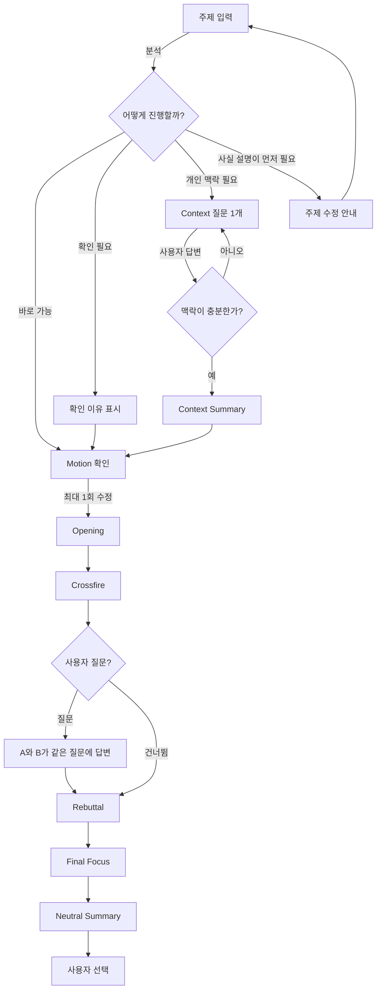
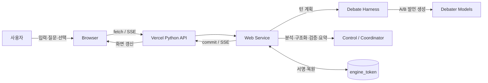
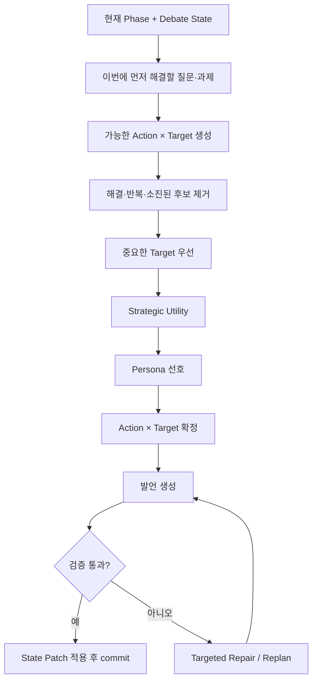
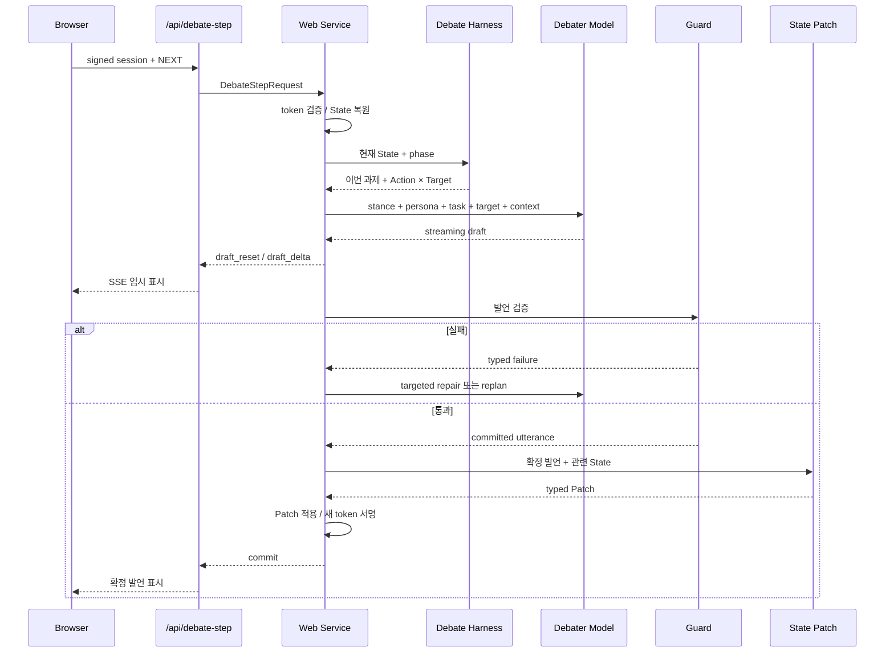

# 사이 — AI Debate Harness

> **두 AI의 찬반 답변을 따로 만들어 나란히 보여주는 서비스가 아니라, 상대의 실제 이전 발언과 구조화된 토론 상태 때문에 다음 발언이 달라지도록 만든 관전형 AI 토론 시스템입니다.**

**사이**는 사용자가 주제를 입력하면 두 AI 토론자가 순차적으로 발언하고, 서로의 주장·질문·반박·양보·수정을 다음 턴의 판단 재료로 사용하는 웹 서비스입니다. 사용자는 토론을 지휘하기보다 공방을 지켜보고, 필요하면 한 번 질문한 뒤 마지막 판단을 직접 내립니다.

| 한눈에 보기 | 내용 |
|---|---|
| **사용자 경험** | 주제 입력 → 필요 시 맥락 확인 → Motion 확인 → AI 토론 관전 → 선택적 질문 → 중립 요약 → 사용자 판단 |
| **핵심 차이** | 다음 발언을 단순히 이어 쓰지 않고, 현재 쟁점과 상태를 읽어 **무엇에 어떻게 대응할지 먼저 결정** |
| **AI 역할** | A/B 토론자는 발언을 생성하고, 별도의 control/coordinator 경로가 분석·구조화·검증·요약 담당 |
| **판정 원칙** | AI가 승자나 점수를 정하지 않으며 최종 선택은 사용자에게 남김 |

**바로 보기:** [전체 흐름](#1-전체-흐름) · [시스템 구조](#2-시스템-구조) · [한 턴의 결정](#3-한-턴은-어떻게-결정되는가) · [Debate State](#4-debate-state) · [Action과 Persona](#5-action과-persona) · [실제 실행 흐름](#6-실제-한-턴의-실행-흐름) · [코드/API](#9-코드와-api-구조)

---

## 1. 전체 흐름

처음 입력된 문장을 바로 찬반 프롬프트에 넣지 않습니다. 먼저 **토론 가능한 주제인지**, **사용자만 알고 있는 맥락이 필요한지**, **사실 설명이 먼저 필요한 입력인지**를 판단합니다.



### 주제 분석

Topic Analyzer는 현재 구현에서 다음 축을 분리합니다.

| 축 | 판단 내용 |
|---|---|
| Claim Type | FACT, DEFINITION, CAUSE, VALUE, POLICY, COMPARISON, INTERPRETATION, PERSONAL_DISPUTE 등 |
| Epistemic Status | 사실 우세인지, 실제로 논쟁 가능한지, 아직 불명확한지 |
| Treatment Mode | 자연스러운 토론 / 가벼운 토론 / 재구성된 토론 |
| Interaction State | 바로 진행 / 확인 필요 / 추가 맥락 필요 / 먼저 정보 설명 필요 |
| Truth Mode | 현실 세계 사실 / 가정된 반사실 / 수사적·놀이형 논쟁 |
| Tone | SERIOUS / PLAYFUL |

개인 사건은 한 번에 하나씩 질문합니다. 답변은 Context Summary에서 **직접 본 일 / 전해 들은 이야기 / 내 해석 / 모르는 부분**으로 구분하고, 사용자가 주지 않은 사건 사실을 AI가 임의로 채우지 않습니다.

Crossfire와 Rebuttal의 턴 수는 반드시 채워야 하는 quota가 아니라 **최대 cap**입니다. 현재 상태에서 더 수행할 가치가 있는 과제가 없으면 Provider를 추가로 호출하기 전에 다음 단계로 이동할 수 있습니다.

---

## 2. 시스템 구조

시스템은 **화면**, **제품 흐름**, **토론 제어**, **AI 생성**을 분리합니다.



| 영역 | 책임 |
|---|---|
| **Browser** | 화면 state, 입력, loading/error UX, provisional draft 표시 |
| **Vercel API** | HTTP/SSE adapter, Pydantic request/response 경계 |
| **Web Service** | 제품 단계 진행, signed session, Provider orchestration |
| **Debate Harness** | Debate State, 현재 과제, Action × Target, Persona, Guard |
| **Debater Models** | 선택된 계획에 따라 실제 A/B 발언 생성 |
| **Control / Coordinator** | 주제 분석, 구조화 출력, State Patch, Compliance, Neutral Summary |

브라우저에는 transcript와 함께 **서명된 `engine_token`**이 있습니다. 이 토큰 안에는 internal Debate State와 Action history가 압축되어 들어가지만, 서버의 HMAC 검증을 통과해야 authoritative state로 인정됩니다.

즉 `engine_token`은 **암호화가 아니라 무결성 보호**입니다. API Key와 Action 선택 로직은 서버에만 존재합니다.

토론 시작 시 `multi-provider debater pool`에서 서로 다른 두 토론자 모델을 A/B에 배정하고, 그 배정은 한 토론 동안 signed session에 고정됩니다.

---

## 3. 한 턴은 어떻게 결정되는가

이 프로젝트의 핵심은 **문장을 생성하기 전에, 이번 턴에서 무엇을 해야 하는지 먼저 정한다는 것**입니다.



| 단계 | 하는 일 |
|---|---|
| **Protocol / Phase** | 지금 단계에서 허용되는 행동 범위를 정함 |
| **Debate State** | 지금까지 실제로 주장·질문·양보·수정된 내용을 보관 |
| **현재 질문·과제** | 이번 발언이 가장 먼저 해결해야 할 것을 정함 |
| **Action × Target** | 어떤 논점에 어떤 방식으로 대응할지 정함 |
| **Persona** | 이미 적법한 후보들 사이에서 선호를 줌 |
| **Guard** | 생성된 문장이 실제 계획·입장·과제를 수행했는지 확인 |
| **State Patch** | 확정된 발언에서 다음 턴에 필요한 변화만 구조화해 저장 |

Persona는 후보를 새로 만들 수 없습니다. 이미 해결됐거나 막힌 행동을 되살릴 수도 없습니다.

---

## 4. Debate State

Debate State는 전체 대화를 다시 요약하기 위한 메모가 아니라 **다음 행동을 결정하기 위한 구조화 상태**입니다.

### 실제로 저장하는 핵심 정보

| 구조 | 의미 |
|---|---|
| **Proposition** | 주장·근거·반례 등의 기본 명제 |
| **Relation** | `SUPPORTS`, `ATTACKS`, `CONTRADICTS`, `QUALIFIES` |
| **Question** | 질문 자체를 별도 Entity로 저장하고 `OPEN / RESOLVED` 관리 |
| **Commitment Event** | `ASSERT`, `CONCEDE`, `WITHDRAW`, `REVISE` |

기존 Proposition text를 덮어써 과거를 지우지 않습니다. 주장을 바꾸면 새 Proposition과 `REVISE` event를 추가합니다.

### 같은 말을 새 ID로 반복하지 않게 하기

새 Proposition이 생겼다고 곧바로 “토론이 진전됐다”고 보지 않습니다. 기존 논점과의 의미 관계를 판정하고, 같은 논지는 하나의 **semantic facet**으로 묶습니다. 따라서 표현만 바꾼 새 Proposition ID로 이미 사용한 Action × Target 제한을 우회하기 어렵게 합니다.

### 현재 가장 먼저 해결할 질문

질문을 오래된 순서대로 전부 다시 꺼내지 않습니다. 현재 쟁점에서 **가장 먼저 해결해야 하는 질문 초점**을 정하고, 한 번의 답변으로 함께 해결할 수 있는 유사 질문은 하나의 Question Group으로 묶을 수 있습니다.

이 구조는 담화를 현재의 Question Under Discussion 중심으로 보는 연구와 복합 질문 턴을 의미 단위로 묶는 접근을 참고했습니다 (Roberts, 2012; Prakken, 2005; D’Agostino et al., 2024).

<details>
<summary><strong>세부 Control State와 Turn Task 보기</strong></summary>

새 Proposition의 의미 관계:

```text
NEW_REASON
SAME_POINT
REFINEMENT
NEW_COUNTEREXAMPLE
QUALIFICATION
RELATED_DISTINCT
```

이번 발언이 해야 할 일:

| 내부 이름 | 의미 |
|---|---|
| `INTRODUCE_UNCOVERED_FACET` | 아직 다뤄지지 않은 핵심 측면 제시 |
| `ANSWER_OPEN_QUESTION` | 현재 열린 핵심 질문에 직접 답변 |
| `ADDRESS_AUDIENCE` | 관객 질문에 직접 답변 |
| `ADDRESS_COUNTEREXAMPLE` | 최근 반례를 처리 |
| `TEST_UNRESOLVED_REASON` | 아직 해결되지 않은 이유를 검증 |
| `WEIGH_COMPETING_REASONS` | 경쟁하는 이유를 같은 기준에서 비교 |
| `NARROW_DISAGREEMENT` | 동의/불일치 범위를 좁힘 |
| `CRYSTALLIZE` | 이미 나온 핵심 충돌을 압축 |
| `NO_VALUABLE_MOVE` | 현재 단계에서 추가 발언 가치가 낮음 |

</details>

> README에서는 아키텍처 이해에 필요한 State만 설명합니다. provenance, source turn, working-set metadata, debug bookkeeping 등 순수 구현 세부 필드는 길이와 가독성을 위해 생략했습니다.

---

## 5. Action과 Persona

### Action: “무슨 말을 할까”보다 먼저 정하는 전략

현재 Runtime에는 15개의 Strategic Action이 있습니다. 각 Action은 단순 이름이 아니라 **target 종류, 반드시 나타나야 할 의미 효과, 실패 조건**을 가진 실행 계약입니다.

```text
Hard Eligibility
→ Action × Target Pair Filter
→ Target Quality
→ Strategic Utility
→ Persona Preference
→ Repetition / Saturation
```

Action×Target pair는 `AVAILABLE / OPEN / PARTIALLY_RESOLVED / RESOLVED / EXHAUSTED / BLOCKED` 상태를 가질 수 있습니다. 이미 충분히 답한 질문, 철회·수정된 주장, 반복 소진된 pair는 다음 후보에서 제외됩니다.

<details>
<summary><strong>15개 Strategic Action 전체 보기</strong></summary>

| Action | 역할 |
|---|---|
| `CLARIFY_CLAIM` | 주장 의미·범위·용어를 명확히 하도록 요구 |
| `REQUEST_SUPPORT` | 주장에 대한 근거·이유·정당화를 요구 |
| `CHALLENGE_PREMISE` | 전제의 사실성·필요성·적용 가능성을 문제 삼음 |
| `CHALLENGE_INFERENCE` | 근거에서 결론으로 가는 추론의 충분성을 문제 삼음 |
| `TEST_BOUNDARY` | 반례·경계 사례로 주장 적용 범위를 시험 |
| `CHECK_CONSISTENCY` | 기존 commitment와 현재 주장 사이의 긴장을 확인 |
| `SEEK_COMMITMENT` | 상대가 특정 기준·명제에 명시적으로 입장을 정하도록 요구 |
| `PRESS_UNANSWERED` | 부분 답변/회피 상태의 핵심 질문을 좁혀 다시 요구 |
| `CONCEDE_LOCAL` | 상대의 특정 논점을 인정하되 전체 입장은 유지 |
| `REVISE_CLAIM` | 자신의 기존 주장을 실제로 수정·한정 |
| `REFUTE_CLAIM` | 상대 주장을 이유와 함께 직접 반박 |
| `DEFEND_CLAIM` | 공격받은 자신의 주장을 근거·구분·한정으로 방어 |
| `EXTEND_ARGUMENT` | 현재 입장을 지지하는 새로운 관련 이유를 추가 |
| `WEIGH_COMPARATIVE` | 경쟁하는 두 고려사항을 같은 기준에서 비교 |
| `CRYSTALLIZE` | 새 핵심 근거 없이 이미 나온 핵심 clash를 압축 |

</details>

### Persona: 캐릭터가 아니라 행동 선호 정책

Persona는 고정된 세계관이나 역할극 캐릭터가 아닙니다. 현재 구현에서는 **이미 적법하다고 판정된 Action 후보들 사이의 안정적인 soft preference**입니다. Stance는 별도의 session assignment이므로 같은 Persona도 다른 토론에서는 반대 입장을 맡을 수 있습니다.

Persona 연구에서 role-playing persona, personality prompting, role과 expressive style의 효과를 구분해서 볼 필요가 있다는 점을 참고했습니다. 이를 바탕으로 현재 구현에서는 Big Five나 MBTI 자체를 runtime 제어 변수로 쓰지 않고, 토론 행동과 직접 연결되는 Persona → Action preference만 사용합니다 (Tseng et al., 2024; Jiang et al., 2024; Nagao et al., 2026).

| Persona | 사용자 표시 | 무엇을 더 자주 시도하는가 |
|---|---|---|
| Auditor | **근거 검증형** | 근거 요구, 추론 연결 검증, 일관성 확인 |
| Socratic | **전제 탐구형** | 정의·범위 확인, 숨은 전제 탐색, 명시적 입장 요구 |
| Falsifier | **반례 탐색형** | 반례·경계 테스트, 일관성 검사, 직접 반박 |
| Pragmatist | **현실 실용형** | 결과·비용·trade-off 비교, 반박과 방어 |
| Principlist | **원칙 중심형** | 기준·전제·일관성 점검, 원칙 기반 이유 확장 |
| Synthesist | **조정 통합형** | 국소적 양보, 주장 수정, 비교와 핵심 압축 |

Topic Analyzer의 claim type에 따라 기능적으로 다른 Persona pair를 선택합니다.

---

## 6. 실제 한 턴의 실행 흐름

아래는 브라우저에서 `/api/debate-step`을 호출한 뒤 한 발언이 확정될 때까지의 실제 runtime 흐름입니다.



화면에 streaming되는 문장은 **확정 전 draft**입니다. Guard와 State Patch까지 통과해야 transcript에 commit됩니다.

### 실패 유형에 맞춘 Repair

검증은 단순한 pass/fail이 아니라 실패 종류를 구분합니다.

- Assigned Stance를 뒤집었는가
- 선택한 Action을 실제로 수행했는가
- target에 제대로 반응했는가
- 이번 턴의 과제를 수행했는가
- 같은 말을 바꿔 반복했는가
- 허용되지 않은 State reference를 출력했는가
- Final Focus 형식을 위반했는가

첫 retry는 이전 draft에서 **무엇을 유지하고 무엇만 바꿀지** 알려주는 targeted repair입니다. 같은 계획으로 고치기 어려운 실패가 반복되면 Action/Target 자체를 다시 고를 수 있습니다. 최대 시도 안에 통과하지 못하면 발언과 State를 확정하지 않습니다.

이 구조는 실패 위치와 허용 가능한 수정 방향을 명시한 structured feedback이 agent repair에 도움을 줄 수 있다는 연구를 참고했습니다 (Ray & Goyal, 2026).

### State Patch와 Adaptive Context

확정 발언 뒤에는 전체 State를 다시 작성하지 않고 필요한 변화만 typed Patch로 추출합니다.

```text
ADD_PROPOSITION
ADD_RELATION
ASK_QUESTION
ANSWER_QUESTION
REVISE_PROPOSITION
CONCEDE_LOCAL
WITHDRAW_PROPOSITION
```

State가 커져도 전체 graph를 매번 넣지 않습니다. 현재 Action target, 질문 초점, semantic facet의 대표/현재 node, 명시적 reference, 최근 양측 Proposition을 중심으로 working set을 만듭니다. Patch용 Proposition working set은 현재 구현에서 최대 10개입니다.

긴 context에서는 필요한 정보의 위치와 양이 모델 활용 성능에 영향을 줄 수 있다는 결과를 참고해, 전체 누적 State보다 현재 과제와 연결된 node를 우선합니다 (Liu et al., 2024).

---

## 7. Prompt Architecture와 Guard

프롬프트는 하나의 거대한 역할 지시문이 아니라 **규칙과 현재 데이터를 층별로 합성**합니다.

```text
Global Hard Rules
→ Grounding (fact anchor / context)
→ Assignment (stance / persona / phase)
→ Phase Instruction
→ 이번 턴 계약 (task + action + target)
→ 허용된 State References
→ Recent Transcript
→ Surface Style / Format
→ Draft
→ Validation
```

Speech prompt는 실제 코드에서 `identity`, `hard_rules`, `grounding`, `assignment`, `phase_instruction`, `surface_style`, `surface_format`처럼 구획을 나눕니다. Motion, Context, transcript, Audience Question은 instruction과 섞이지 않도록 data 영역으로 전달합니다.

전역 품질 규칙은 Persona보다 우선합니다.

- 사용자가 제공하지 않은 개인 사건 사실을 만들지 않음
- 존재하지 않는 통계·연구·인용을 만들어 한쪽을 강화하지 않음
- 상대가 실제로 하지 않은 주장을 공격하지 않음
- 질문에는 먼저 직접 답함
- 유효한 반론은 국소적으로 인정할 수 있음
- 세부 주장은 수정할 수 있지만 Assigned Stance 전체를 뒤집지 않음

---

## 8. Debate Protocol, Moderator, Frontend

### Crossfire

Crossfire는 정해진 질문을 번갈아 읽는 단계가 아닙니다. 현재 Debate State에서 살아 있는 논점을 골라 **질문, 반례, 추론 공격, commitment 요구, 국소적 양보, 주장 수정**으로 상태를 변화시키는 구간입니다.

관전 재미도 별도 농담 생성 모듈보다 **상대의 방금 한 발언을 이용한 callback, 반례, 양보, 수정, 새로운 충돌**에서 나오도록 설계했습니다. PLAYFUL 주제에서는 가벼운 비유나 논증에서 나온 유머를 허용하지만 상대 인격 공격은 허용하지 않습니다.

### Moderator는 별도 AI가 아님

| 책임 | 실제 역할 |
|---|---|
| **Server Control Plane** | 더 말할 가치가 있는지, Audience gate를 열지, 다음 phase로 갈지 결정 |
| **Frontend Moderator** | 서버의 결정을 사용자가 이해할 수 있는 사회자 카드로 표현 |

`public/debate_moderator.js`가 새로운 LLM 판단을 추가하는 것이 아닙니다.

### Audience Question / Final Focus / Neutral Summary

- **Audience Question**: A와 B가 같은 사용자 질문에 차례로 직접 답함
- **Final Focus**: 새 핵심 근거 없이 이미 나온 가장 중요한 이유를 짧게 압축
- **Neutral Summary**: 핵심 충돌, A/B의 강한 논점, 합의, 남은 질문만 정리하며 승자·점수·정답은 정하지 않음

### Frontend Runtime

Frontend는 결과를 출력하는 것 외에도 긴 AI 작업의 lifecycle을 관리합니다.

- operation sequence로 stale response 차단
- `AbortController`를 이용한 지연/timeout 처리
- SSE `draft_reset → draft_delta → commit/error`
- provisional draft와 committed transcript 분리
- Markdown sanitize/render
- State reference를 사람이 읽을 수 있는 발언 링크로 변환
- deterministic moderator card
- 모바일/데스크톱 반응형 UI
- raw stack trace 대신 안정적인 오류 메시지 표시

토론자가 `[[C24]]`, `[[Q3]]` 같은 내부 State marker를 사용하면 서버는 확정 후 `StateReference` metadata로 변환하고, Frontend는 사용자에게 **A/B · 발언 번호** 형태의 링크로 보여줍니다.

---

## 9. 코드와 API 구조

상위 구조만 보면 다음 네 영역으로 나뉩니다.

```text
public/                 Browser UI
api/                    Vercel Python Serverless 진입점
src/web_app/            Web DTO, 세션, Mock/Live orchestration
src/debate_engine/      토론 상태·행동 선택·검증 Core
```

<details>
<summary><strong>주요 파일별 역할 보기</strong></summary>

```text
public/
  index.html                 화면 구조와 3개 주요 섹션
  styles.css                 반응형 레이아웃과 상태별 UI
  app.js                     UI state, fetch/SSE, 토론 진행, 오류 처리
  debate_stream.js           Server-Sent Events parser
  debate_moderator.js        서버의 진행 결정을 사회자 카드로 표현
  markdown_renderer.js       Markdown + State reference 렌더링

api/
  _base.py                   공통 HTTP/SSE adapter
  analyze_topic.py           /api/analyze-topic
  context_step.py            /api/context-step
  create_motion.py           /api/create-motion
  debate_step.py             /api/debate-step
  neutral_summary.py         /api/neutral-summary
  health.py                  /api/health

src/web_app/
  contracts.py               Browser ↔ Server Pydantic DTO
  api.py                     API dispatcher와 공통 오류 응답
  live_service.py            실제 AI orchestration
  mock_service.py            Provider 호출 없는 동일 제품 흐름
  session_token.py           zlib + HMAC signed session
  service_factory.py         Mock / Live service 선택

src/debate_engine/
  debate_contracts.py        Proposition / Relation / Question / Patch 계약
  debate_control.py          semantic facet, 질문 초점, progress, 이번 턴 과제
  action_policy.py           Action 후보 생성과 선택
  action_pair_state.py       Action × Target 반복/소진 상태
  target_quality.py          target 중요도·행동 가능성 평가
  persona_preferences.py     Persona별 soft preference
  action_execution_contracts.py  15개 Action 의미 계약
  combined_compliance.py     Action / Stance / Task 통합 검증과 retry
  stance_compliance.py       Assigned Stance 유지 검사
  surface_contract.py        출력 형식과 State reference 검사
  state_harness.py           State Patch 추출·검증·적용
```

</details>

### API

| Endpoint | 역할 |
|---|---|
| `POST /api/analyze-topic` | 주제 성격과 진행 방식 분석 |
| `POST /api/context-step` | 필요한 개인 맥락을 한 질문씩 수집 |
| `POST /api/create-motion` | Motion, side label, Persona pair 결정 |
| `POST /api/debate-step` | planning → generation → validation → State update |
| `POST /api/neutral-summary` | 승자 판정 없는 토론 정리 |
| `/api/health` | live config와 배포 version 확인, Provider 호출 없음 |

Browser-facing DTO는 Pydantic `extra="forbid"` 계약을 사용하며 내부 Patch와 Control State를 일반 Web DTO에 그대로 노출하지 않습니다.

> 전체 Pydantic field와 bookkeeping 값은 문서 길이와 가독성을 위해 생략했습니다.

---

## 10. 기술 스택과 실행·배포

| 영역 | 기술 |
|---|---|
| Frontend | HTML, CSS, Vanilla JavaScript |
| Backend | Python 3.12, Vercel Serverless Functions |
| Schema / Validation | Pydantic |
| Streaming | Server-Sent Events (SSE) |
| AI Integration | OpenAI-compatible Chat Completions / Tool Calling |
| Debater Routing | multi-provider debater pool |
| Session | zlib-compressed + HMAC-SHA256 signed client-carried state |
| Deployment | GitHub + Vercel |

- **배포 URL**: https://a1-3-green.vercel.app
- **GitHub**: https://github.com/hodob/A1-3
- **비밀 환경 변수**: `DEBATER_API_KEY`, `SESSION_SECRET`
- **일반 실행 설정**: `config.json`

로컬에서는 `.env.example`을 참고해 `.env`에 두 secret을 설정합니다. Provider 호출 없이 UI 흐름만 확인할 때는 Mock 개발 서버를 사용할 수 있습니다.

```bash
python -m etc.tools.web_dev_server
```

Vercel에서는 Project Settings의 Environment Variables에 같은 secret을 등록합니다. `public/`은 정적 Frontend로 제공되고 `api/*.py`는 Python Serverless Function으로 실행됩니다. GitHub 저장소와 연결된 Vercel 프로젝트는 `main` 변경에 따라 배포됩니다.

---

## References

- Tseng, Yu-Min et al. (2024). *Two Tales of Persona in LLMs: A Survey of Role-Playing and Personalization*. Findings of EMNLP 2024. https://aclanthology.org/2024.findings-emnlp.969/
- Jiang, Hang et al. (2024). *PersonaLLM: Investigating the Ability of Large Language Models to Express Personality Traits*. Findings of NAACL 2024. https://aclanthology.org/2024.findings-naacl.229/
- Nagao, Moe et al. (2026). *Personality, Role, and Expressive Style in Large Language Models: An Interactionist Analysis*. arXiv preprint. https://arxiv.org/abs/2605.28037
- Roberts, Craige (2012). *Information Structure in Discourse: Towards an Integrated Formal Theory of Pragmatics*. Semantics & Pragmatics, 5. https://doi.org/10.3765/sp.5.6
- Prakken, Henry (2005). *Coherence and Flexibility in Dialogue Games for Argumentation*. Journal of Logic and Computation. https://doi.org/10.1093/logcom/exi046
- D’Agostino, Giulia, Chris Reed, and Daniele Puccinelli (2024). *Segmentation of Complex Question Turns for Argument Mining: A Corpus-based Study in the Financial Domain*. LREC-COLING 2024. https://aclanthology.org/2024.lrec-main.1265/
- Liu, Nelson F. et al. (2024). *Lost in the Middle: How Language Models Use Long Contexts*. Transactions of the Association for Computational Linguistics, 12, 157–173. https://aclanthology.org/2024.tacl-1.9/
- Ray, Jaideep & Ankit Goyal (2026). *Structured Feedback Improves Repair in an LLM Agent Loop*. arXiv preprint. https://arxiv.org/abs/2607.14167
