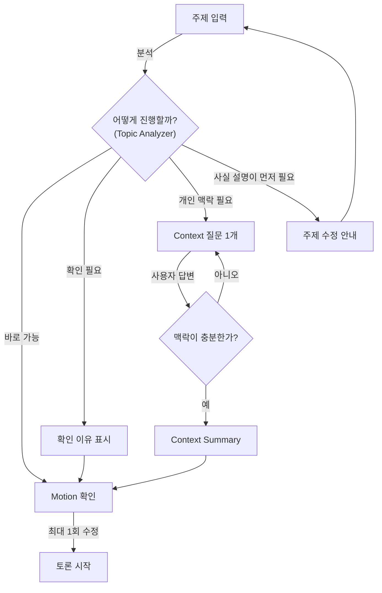
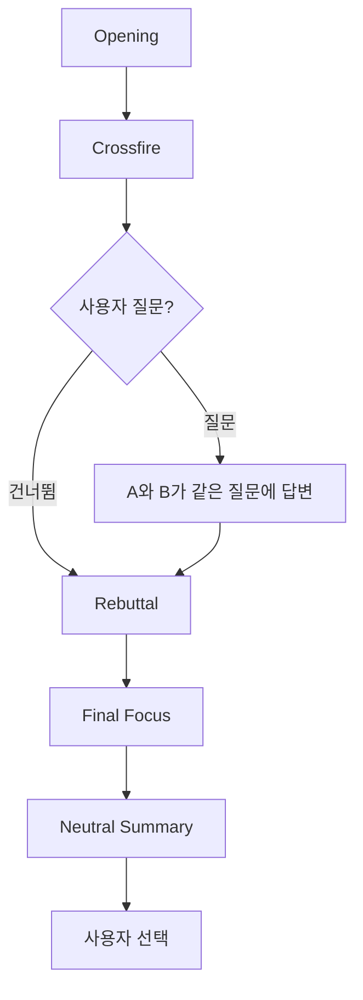
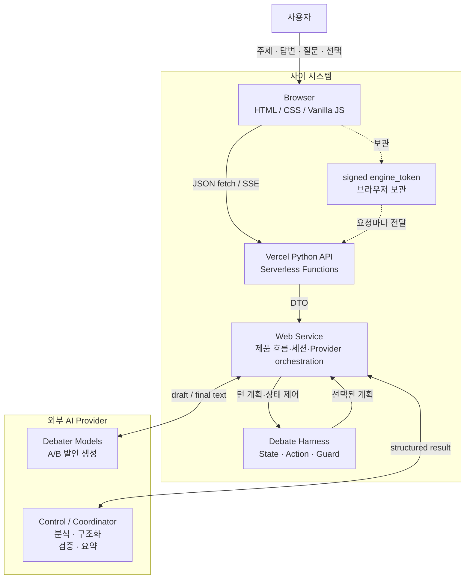
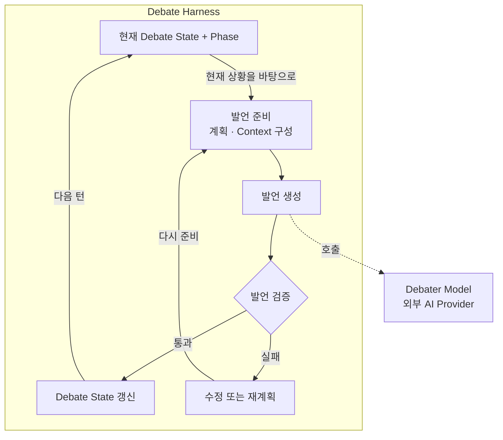
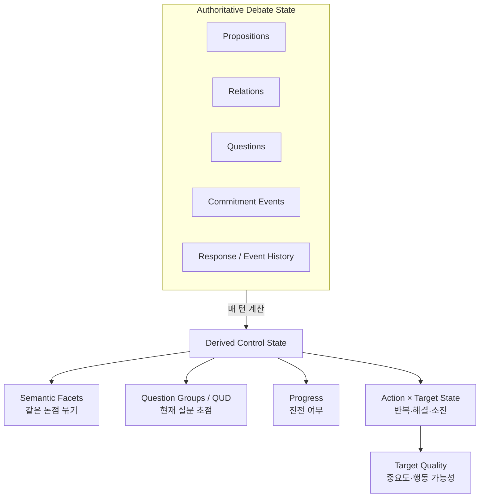
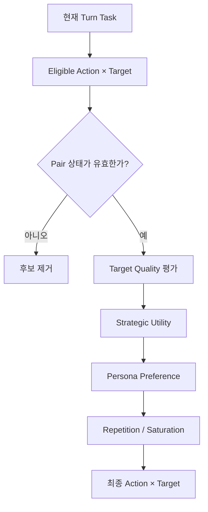
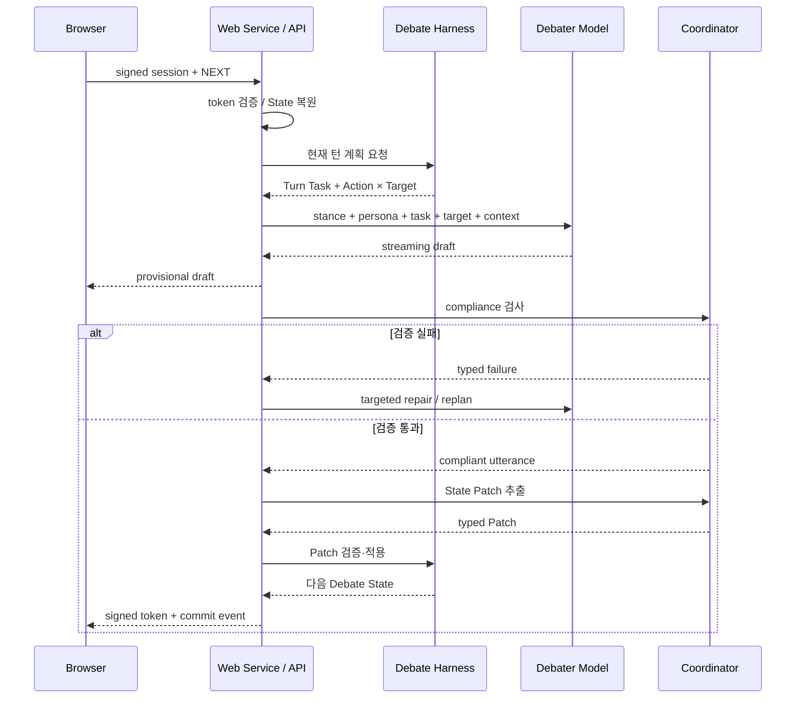
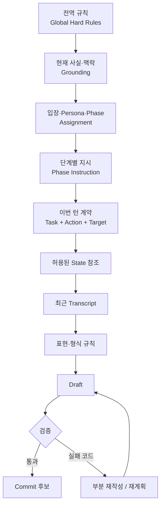
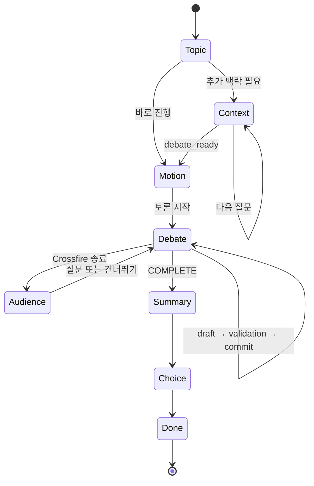
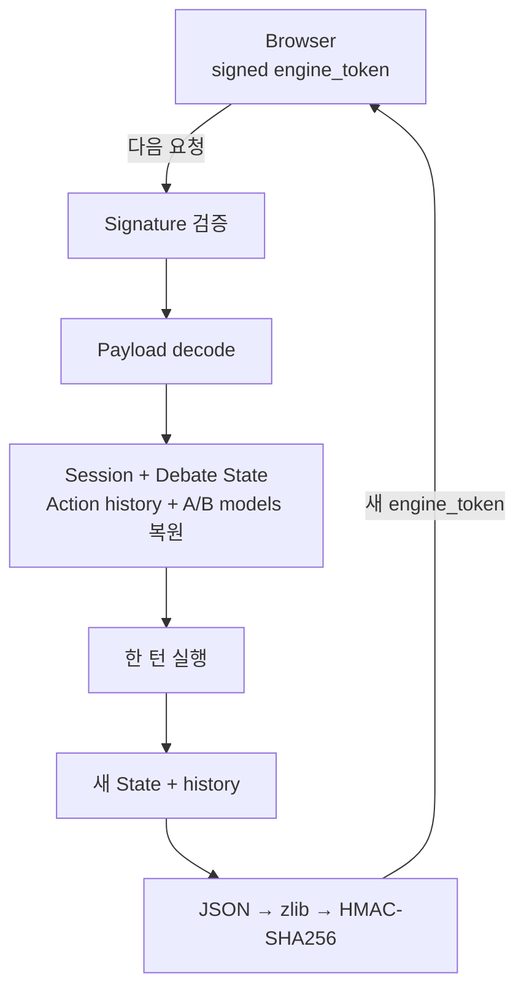

# 사이 — AI Debate Harness

> **두 AI의 찬반 답변을 따로 만들어 나란히 보여주는 서비스가 아니라, 상대의 실제 이전 발언과 구조화된 토론 상태 때문에 다음 발언이 달라지도록 만든 관전형 AI 토론 시스템이다.**

**사이**는 사용자가 주제를 입력하면 두 AI 토론자가 순차적으로 발언하고, 서로의 주장·질문·반박·양보·수정을 다음 턴의 판단 재료로 사용하는 웹 서비스다. 사용자는 토론을 지휘하기보다 공방을 지켜보고, 필요하면 한 번 질문한 뒤 마지막 판단을 직접 내린다.

## 목차

1. [전체 사용자 흐름](#1-전체-사용자-흐름)
2. [시스템 경계와 실행 구조 (Runtime)](#2-시스템-경계와-실행-구조-runtime)
3. [코드 구성 요소 구조](#3-코드-구성-요소-구조)
4. [토론 엔진 구조 (Debate Engine)](#4-토론-엔진-구조-debate-engine)
5. [토론 상태 (Debate State): 무엇을 기억하는가](#5-토론-상태-debate-state-무엇을-기억하는가)
6. [행동 선택과 Persona](#6-행동-선택과-persona)
7. [한 턴의 실행 순서 (Runtime Sequence)](#7-한-턴의-실행-순서-runtime-sequence)
8. [프롬프트와 검증 흐름 (Prompt / Validation)](#8-프롬프트와-검증-흐름-prompt--validation)
9. [화면 상태와 세션 실행 구조 (Frontend / Session)](#9-화면-상태와-세션-실행-구조-frontend--session)
10. [토론 진행 규칙과 사회자 표시 (Moderator)](#10-토론-진행-규칙과-사회자-표시-moderator)
11. [구현 참고 정보 (Implementation Reference)](#11-구현-참고-정보-implementation-reference)
12. [References](#references)

---

## 1. 전체 사용자 흐름

처음 입력된 문장을 바로 찬반 프롬프트에 넣지 않는다. 먼저 토론 가능한 주제인지, 사용자만 알고 있는 맥락이 필요한지, 사실 설명이 먼저 필요한 입력인지 판단한 뒤 토론을 시작한다.

### 1.1 토론을 시작하기 전

**그림 1. 토론 준비 흐름 (Product Flow) — 주제를 토론 가능한 상태로 만드는 과정**



Topic Analyzer는 주제를 하나의 유형으로만 분류하지 않는다. 이후 시스템이 내려야 하는 서로 다른 결정을 각각의 분석 정보로 나누고, 각 항목이 서로 다른 주된 책임을 맡도록 구성한다.

1. `claim_type` — **무슨 종류의 논쟁인지** 분류
2. `epistemic_status` — **현실에서 사실적으로 어떤 상태인지** 구분
3. `treatment_mode` — **이 입력을 어떤 방식으로 토론할지** 결정
4. `interaction_state` — **사용자에게 다음에 무엇을 요구할지** 결정
5. `truth_mode` — **현실 사실과 가정·놀이를 어떻게 구분할지** 설정
6. `tone_hint` — **어떤 표현 스타일로 말할지** 결정

아래 값은 README용으로 다시 만든 분류가 아니라 `TopicAnalysis` 계약에 정의된 실제 허용 값이다. 현재 구현은 Python `Enum` 클래스가 아니라 Pydantic DTO의 `Literal` 타입으로 값을 제한한다.

| 계약 필드 | 실제 허용 값(한글 의미) |
|---|---|
| `claim_type`(주제 유형) | `FACT`(사실), `DEFINITION`(정의), `CAUSE`(원인), `VALUE`(가치), `POLICY`(정책), `COMPARISON`(비교), `INTERPRETATION`(해석), `PERSONAL_DISPUTE`(개인 갈등), `INFORMATIONAL`(정보 요청), `OTHER`(기타) |
| `epistemic_status`(사실적 지위) | `NON_FACTUAL`(사실 판정 대상 아님), `OPEN_EMPIRICAL`(경험적으로 열린 문제), `GENUINELY_CONTESTED`(실질적 논쟁 상태), `WEIGHT_DOMINANT_TRUE`(참 쪽 근거 우세), `WEIGHT_DOMINANT_FALSE`(거짓 쪽 근거 우세), `FORMALLY_SETTLED`(형식적으로 확정), `UNKNOWN`(불명확) |
| `treatment_mode`(토론 처리 방식) | `NATURAL_DEBATE`(그대로 토론), `PLAYFUL_DEBATE`(놀이형 토론), `REFRAMED_DEBATE`(토론형으로 재구성) |
| `interaction_state`(진행 상태) | `READY`(바로 진행), `CONFIRMATION_REQUIRED`(사용자 확인 필요), `CONTEXT_REQUIRED`(추가 맥락 필요), `INFORMATIONAL_FIRST`(정보 설명이 먼저 필요) |
| `truth_mode`(현실성 프레임) | `REAL_WORLD`(현실 세계, 기본값), `STIPULATED_COUNTERFACTUAL`(명시적으로 가정한 반사실), `RHETORICAL_PLAY`(수사적·놀이형 설정) |
| `tone_hint`(표현 어조 힌트) | `SERIOUS`(진지함), `PLAYFUL`(가벼움), `None`(미지정 가능) |

개인 사건은 한 번에 하나씩 질문한다. 답변은 Context Summary에서 **직접 본 일 / 전해 들은 이야기 / 내 해석 / 모르는 부분**으로 구분하고, 사용자가 주지 않은 사건 사실을 AI가 임의로 채우지 않는다.

### 1.2 토론이 시작된 뒤

**그림 2. 토론 진행 흐름 (Debate Protocol) — 탐색에서 최종 판단까지**



토론 단계의 기본 골격은 Public Forum Debate에서 볼 수 있는 Constructive–Crossfire–Rebuttal–Final Focus의 진행 요소를 참고하되, 관전형 서비스에 맞게 단순화했다.

| 단계 | 역할 |
|---|---|
| Opening | 각 토론자가 입장과 핵심 이유를 제시하고 첫 충돌 지점을 만든다. |
| Crossfire | 질문·반례·검증을 통해 상대 주장을 시험하고 실제 쟁점을 드러낸다. |
| 사용자 질문 | 사용자가 원할 때 같은 질문을 A와 B 모두에게 던져 두 입장을 같은 기준에서 비교한다. |
| Rebuttal | Crossfire에서 드러난 핵심 충돌을 직접 반박·방어하고 필요한 경우 국소적으로 양보하거나 주장을 수정한다. |
| Final Focus | 새로운 핵심 논점을 늘리지 않고 마지막까지 남길 이유 1~2개를 압축한다. |
| Neutral Summary | 승자를 정하지 않고 핵심 충돌, 양측의 강한 논점, 합의된 부분, 남은 쟁점을 정리한다. |
| 사용자 선택 | Neutral Summary까지 본 사용자가 A / 모르겠다 / B 중 최종 판단을 직접 선택한다. |

Crossfire와 Rebuttal의 턴 수는 반드시 채워야 하는 quota가 아니라 최대 cap이다. 현재 상태에서 더 수행할 가치가 있는 과제가 없으면 Provider를 추가로 호출하기 전에 다음 단계로 이동할 수 있다.

다음 절에서는 이 Product Flow가 실제 Browser, Serverless Function, Debate Harness, AI Provider로 어떻게 나뉘어 실행되는지 보여준다.

---

## 2. 시스템 경계와 실행 구조 (Runtime)

시스템은 화면, 제품 흐름, 토론 제어, 실제 발언 생성을 분리한다.

**그림 3. 시스템 경계 (System Context / Container View) — 사이와 외부 AI Provider**



---

## 3. 코드 구성 요소 구조

```text
public/
  index.html                 화면 구조와 3개 주요 섹션
  styles.css                 반응형 레이아웃과 상태별 UI
  app.js                     UI state, fetch/SSE, 토론 진행, 오류 처리
  debate_stream.js           Server-Sent Events parser
  debate_moderator.js        서버의 진행 결정을 사회자 카드로 표현
  markdown_renderer.js       Markdown + State reference 렌더링

api/
  _base.py                   공통 HTTP/SSE adapter
  analyze_topic.py           /api/analyze-topic
  context_step.py            /api/context-step
  create_motion.py           /api/create-motion
  debate_step.py             /api/debate-step
  neutral_summary.py         /api/neutral-summary
  health.py                  /api/health

src/web_app/
  contracts.py               Browser ↔ Server Pydantic DTO
  api.py                     API dispatcher와 공통 오류 응답
  live_service.py            실제 AI orchestration
  mock_service.py            Provider 호출 없는 동일 제품 흐름
  session_token.py           zlib + HMAC signed session
  service_factory.py         Mock / Live service 선택

src/debate_engine/
  debate_contracts.py        Proposition / Relation / Question / Patch 계약
  debate_control.py          semantic facet, 질문 초점, progress, 이번 턴 과제
  action_policy.py           Action 후보 생성과 선택
  action_pair_state.py       Action × Target 반복/소진 상태
  target_quality.py          target 중요도·행동 가능성 평가
  persona_preferences.py     Persona별 soft preference
  action_execution_contracts.py  15개 Action 의미 계약
  combined_compliance.py     Action / Stance / Task 통합 검증과 retry
  stance_compliance.py       Assigned Stance 유지 검사
  surface_contract.py        출력 형식과 State reference 검사
  state_harness.py           State Patch 추출·검증·적용
```
---

## 4. 토론 엔진 구조 (Debate Engine)

**Debate Harness는 발언을 생성하는 모델이 아니라, 한 턴의 진행을 제어하는 제어 루프(control loop)다.** 현재 `Debate State`와 `Phase`를 보고 이번 턴에서 무엇을 다뤄야 할지 정한 뒤 필요한 Context를 구성한다. 그 준비를 바탕으로 외부 `Debater Model`을 호출해 발언 후보를 얻고, 검증을 통과한 결과만 다음 `Debate State`에 반영한다.

**그림 4. Debate Harness 제어 흐름 — 상태 확인 → 발언 준비 → 생성 → 검증 → 상태 갱신**



| 단계 | 역할 |
|---|---|
| 상태 확인 | 현재 `Debate State`와 `Phase`에서 이번 턴이 놓인 상황을 읽는다. |
| 발언 준비 | 이번 발언이 먼저 해결해야 할 과제와 전략을 정하고, 생성에 필요한 Context를 구성한다. |
| 발언 생성 | 외부 `Debater Model`을 호출해 준비된 조건에 맞는 발언 후보를 받는다. |
| 발언 검증 | 발언 후보가 계획·입장·형식 제약을 충족하는지 확인한다. |
| 상태 갱신 | 통과한 발언에서 다음 턴에 필요한 변화를 `Debate State`에 반영한다. |

검증에 실패한 발언은 State에 반영하지 않는다. 실패 원인에 따라 기존 계획을 유지한 채 다시 생성하거나, 필요한 경우 계획 자체를 다시 고른 뒤 발언 준비 단계로 돌아간다.

`Turn Task`, `Action × Target`, Persona preference는 **다음 턴 계획 내부의 세부 메커니즘**이다. 5절에서는 계획의 입력이 되는 Debate State를, 6절에서는 Action × Target 선택을, 7절에서는 실제 한 턴의 실행을, 8절에서는 검증과 수정 경로를 각각 확대한다.

---

## 5. 토론 상태 (Debate State): 무엇을 기억하는가

Debate State는 전체 대화를 다시 요약하기 위한 메모가 아니라 **다음 행동을 결정하기 위한 구조화 상태**다.

**그림 5. 토론 상태 구조 (Debate State View) — 확정 상태와 파생 제어 상태**



### 실제로 저장하는 핵심 정보

| 구조 | 의미 |
|---|---|
| **Proposition** | 주장·근거·반례 등의 기본 명제 |
| **Relation** | `SUPPORTS`, `ATTACKS`, `CONTRADICTS`, `QUALIFIES` |
| **Question** | 질문 자체를 별도 Entity로 저장하고 `OPEN / RESOLVED` 관리 |
| **Commitment Event** | `ASSERT`, `CONCEDE`, `WITHDRAW`, `REVISE` |

기존 Proposition text를 덮어써 과거를 지우지 않는다. 주장을 바꾸면 새 Proposition과 `REVISE` event를 추가한다.

### 같은 말을 새 ID로 반복하지 않게 하기

새 Proposition이 생겼다고 곧바로 “토론이 진전됐다”고 보지 않는다. 기존 논점과의 의미 관계를 판정하고 같은 논지는 하나의 **semantic facet**으로 묶는다. 따라서 표현만 바꾼 새 Proposition ID로 반복 제한을 우회하기 어렵게 한다.

### 현재 가장 먼저 해결할 질문

질문을 오래된 순서대로 전부 다시 꺼내지 않는다. 현재 쟁점에서 **가장 먼저 해결해야 하는 질문 초점**을 정하고, 한 번의 답변으로 함께 해결할 수 있는 유사 질문은 하나의 Question Group으로 묶을 수 있다.

이 구조는 담화를 현재의 Question Under Discussion 중심으로 보는 연구와 복합 질문 턴을 의미 단위로 묶는 접근을 참고했다 (Roberts, 2012; Prakken, 2005; D’Agostino et al., 2024).

<details>
<summary><strong>세부 Control State와 Turn Task 전체 보기</strong></summary>

새 Proposition의 의미 관계:

```text
NEW_REASON
SAME_POINT
REFINEMENT
NEW_COUNTEREXAMPLE
QUALIFICATION
RELATED_DISTINCT
```

이번 발언이 해야 할 일:

| 내부 이름 | 의미 |
|---|---|
| `INTRODUCE_UNCOVERED_FACET` | 아직 다뤄지지 않은 핵심 측면 제시 |
| `ANSWER_OPEN_QUESTION` | 현재 열린 핵심 질문에 직접 답변 |
| `ADDRESS_AUDIENCE` | 관객 질문에 직접 답변 |
| `ADDRESS_COUNTEREXAMPLE` | 최근 반례를 처리 |
| `TEST_UNRESOLVED_REASON` | 아직 해결되지 않은 이유를 검증 |
| `WEIGH_COMPETING_REASONS` | 경쟁하는 이유를 같은 기준에서 비교 |
| `NARROW_DISAGREEMENT` | 동의/불일치 범위를 좁힘 |
| `CRYSTALLIZE` | 이미 나온 핵심 충돌을 압축 |
| `NO_VALUABLE_MOVE` | 현재 단계에서 추가 발언 가치가 낮음 |

</details>

> 그림의 위쪽은 확정된 Debate State, 아래쪽은 매 턴 계산되는 제어 상태다. README에서는 아키텍처 이해에 필요한 State만 설명한다. provenance, source turn, working-set metadata, debug bookkeeping 등 순수 구현 세부 필드는 길이와 가독성을 위해 생략한다.


다음 절에서는 이 State를 바탕으로 실제 Action × Target 후보를 어떻게 좁히는지 보여줍니다.

---

## 6. 행동 선택과 Persona

### 6.1 어떤 논점에 어떤 행동을 할지 고르는 과정

Action은 단순히 “다음에 할 말의 제목”이 아니라 **target 종류, 필요한 의미 효과, 실패 조건**을 가진 실행 계약이다.

**그림 6. 행동 선택 흐름 (Action Selection View) — 후보를 단계적으로 좁히는 과정**



Action×Target pair는 `AVAILABLE / OPEN / PARTIALLY_RESOLVED / RESOLVED / EXHAUSTED / BLOCKED` 상태를 가질 수 있다. 이미 충분히 답한 질문, 철회·수정된 주장, 반복 소진된 pair는 다음 후보에서 제외된다.

<details>
<summary><strong>15개 Strategic Action 전체 보기</strong></summary>

| Action | 역할 |
|---|---|
| `CLARIFY_CLAIM` | 주장 의미·범위·용어를 명확히 하도록 요구 |
| `REQUEST_SUPPORT` | 주장에 대한 근거·이유·정당화를 요구 |
| `CHALLENGE_PREMISE` | 전제의 사실성·필요성·적용 가능성을 문제 삼음 |
| `CHALLENGE_INFERENCE` | 근거에서 결론으로 가는 추론의 충분성을 문제 삼음 |
| `TEST_BOUNDARY` | 반례·경계 사례로 주장 적용 범위를 시험 |
| `CHECK_CONSISTENCY` | 기존 commitment와 현재 주장 사이의 긴장을 확인 |
| `SEEK_COMMITMENT` | 상대가 특정 기준·명제에 명시적으로 입장을 정하도록 요구 |
| `PRESS_UNANSWERED` | 부분 답변/회피 상태의 핵심 질문을 좁혀 다시 요구 |
| `CONCEDE_LOCAL` | 상대의 특정 논점을 인정하되 전체 입장은 유지 |
| `REVISE_CLAIM` | 자신의 기존 주장을 실제로 수정·한정 |
| `REFUTE_CLAIM` | 상대 주장을 이유와 함께 직접 반박 |
| `DEFEND_CLAIM` | 공격받은 자신의 주장을 근거·구분·한정으로 방어 |
| `EXTEND_ARGUMENT` | 현재 입장을 지지하는 새로운 관련 이유를 추가 |
| `WEIGH_COMPARATIVE` | 경쟁하는 두 고려사항을 같은 기준에서 비교 |
| `CRYSTALLIZE` | 새 핵심 근거 없이 이미 나온 핵심 clash를 압축 |

</details>

### 6.2 Persona는 캐릭터가 아니라 행동 선호 정책

Persona는 고정된 세계관이나 역할극 캐릭터가 아니다. 현재 구현에서 Persona는 **이미 적법하다고 판정된 Action 후보들 사이의 안정적인 soft preference**다. Stance는 별도의 session assignment이므로 같은 Persona도 다른 토론에서는 반대 입장을 맡을 수 있다.

Persona 연구에서 role-playing persona, personality prompting, role과 expressive style의 효과를 구분해서 볼 필요가 있다는 점을 참고했다. 이를 바탕으로 현재 구현에서는 Big Five나 MBTI 자체를 runtime 제어 변수로 쓰지 않고, 토론 행동과 직접 연결되는 Persona → Action preference만 사용한다 (Tseng et al., 2024; Jiang et al., 2024; Nagao et al., 2026).

| Persona | 사용자 표시 | 무엇을 더 자주 시도하는가 |
|---|---|---|
| Auditor | **근거 검증형** | 근거 요구, 추론 연결 검증, 일관성 확인 |
| Socratic | **전제 탐구형** | 정의·범위 확인, 숨은 전제 탐색, 명시적 입장 요구 |
| Falsifier | **반례 탐색형** | 반례·경계 테스트, 일관성 검사, 직접 반박 |
| Pragmatist | **현실 실용형** | 결과·비용·trade-off 비교, 반박과 방어 |
| Principlist | **원칙 중심형** | 기준·전제·일관성 점검, 원칙 기반 이유 확장 |
| Synthesist | **조정 통합형** | 국소적 양보, 주장 수정, 비교와 핵심 압축 |

Topic Analyzer의 claim type에 따라 기능적으로 다른 Persona pair를 선택한다. Persona는 후보를 새로 만들 수 없고 이미 `RESOLVED / EXHAUSTED / BLOCKED` 상태인 행동을 되살릴 수도 없다.


다음 절에서는 선택된 Action × Target이 실제 발언으로 생성되고 commit될 때까지의 Runtime을 보여줍니다.

---

## 7. 한 턴의 실행 순서 (Runtime Sequence)

아래 그림은 Browser에서 `/api/debate-step`을 호출한 뒤 한 발언이 확정될 때까지의 대표 Runtime scenario다. 상위 Adapter와 내부 Validator를 각각 별도 participant로 늘어놓기보다, 앞에서 설명한 구성 요소 수준으로 묶는다.

**그림 7. 한 턴 실행 순서 (Runtime Sequence) — request → draft → validation → patch → commit**



화면에 streaming되는 문장은 **확정 전 draft**다. Compliance와 State Patch 적용까지 통과해야 transcript에 commit된다.

### State Patch와 Adaptive Context

확정 발언 뒤에는 전체 State를 다시 작성하지 않고 필요한 변화만 typed Patch로 추출한다.

```text
ADD_PROPOSITION
ADD_RELATION
ASK_QUESTION
ANSWER_QUESTION
REVISE_PROPOSITION
CONCEDE_LOCAL
WITHDRAW_PROPOSITION
```

State가 커져도 전체 graph를 매번 넣지 않는다. 현재 Action target, 질문 초점, semantic facet의 대표/현재 node, 명시적 reference, 최근 양측 Proposition을 중심으로 working set을 만든다. Patch용 Proposition working set은 현재 구현에서 최대 10개다.

긴 context에서는 필요한 정보의 위치와 양이 모델 활용 성능에 영향을 줄 수 있다는 결과를 참고해, 전체 누적 State보다 현재 과제와 연결된 node를 우선한다 (Liu et al., 2024).

다음 절에서는 이 sequence의 **발언 생성 → compliance → repair** 구간 안에 어떤 정보가 들어가는지 확대한다.

---

## 8. 프롬프트와 검증 흐름 (Prompt / Validation)

프롬프트는 하나의 거대한 역할 지시문이 아니라 변하지 않는 규칙, 현재 세션 정보, 이번 턴의 과제, 허용된 State context를 분리해 합성한다.

**그림 8. 프롬프트와 검증 흐름 (Prompt / Validation View) — 입력 계층과 Repair loop**



Speech prompt는 실제 코드에서 `identity`, `hard_rules`, `grounding`, `assignment`, `phase_instruction`, `surface_style`, `surface_format`처럼 구획을 나눈다. Motion, Context, transcript, Audience Question은 instruction과 섞이지 않도록 data 영역으로 전달한다.

전역 품질 규칙은 Persona보다 우선한다.

- 사용자가 제공하지 않은 개인 사건 사실을 만들지 않음
- 존재하지 않는 통계·연구·인용을 만들어 한쪽을 강화하지 않음
- 상대가 실제로 하지 않은 주장을 공격하지 않음
- 질문에는 먼저 직접 답함
- 유효한 반론은 국소적으로 인정할 수 있음
- 세부 주장은 수정할 수 있지만 Assigned Stance 전체를 뒤집지 않음

### 실패 유형에 맞춘 Repair

검증은 단순 pass/fail이 아니라 stance reversal, Action 미수행, target 미사용, off-task, 반복, 잘못된 State reference, Final Focus 형식 위반 등을 구분한다.

첫 retry는 이전 draft에서 무엇을 유지하고 무엇만 바꿀지 알려주는 targeted repair다. 같은 계획으로 고치기 어려운 실패가 반복되면 Action/Target 자체를 다시 고를 수 있다. 최대 시도 안에 통과하지 못하면 발언과 State를 확정하지 않는다.

이 구조는 실패 위치와 허용 가능한 수정 방향을 명시한 structured feedback이 agent repair에 도움을 줄 수 있다는 연구를 참고했다 (Ray & Goyal, 2026).

---

## 9. 화면 상태와 세션 실행 구조 (Frontend / Session)

### 9.1 Frontend 화면 상태

Frontend는 API 결과를 출력하는 것 외에도 **긴 AI 작업 중 사용자가 어떤 단계에 있는지**를 관리한다.

**그림 9. 화면 상태 전이 (UI State Machine) — 사용자가 보는 단계의 lifecycle**



다른 주제로 다시 시작하면 기존 토론을 이어가는 상태 전이가 아니라 새 Topic 상태에서 새 세션을 시작한다.

주요 Frontend 책임:

- operation sequence로 stale response 차단
- `AbortController`를 이용한 지연/timeout 처리
- SSE `draft_reset → draft_delta → commit/error`
- provisional draft와 committed transcript 분리
- Markdown sanitize/render
- State reference를 사람이 읽을 수 있는 발언 링크로 변환
- 서버의 진행 결정을 deterministic moderator card로 표현
- 모바일/데스크톱 반응형 UI
- raw stack trace 대신 안정적인 오류 메시지 표시

토론자가 `[[C24]]`, `[[Q3]]` 같은 내부 State marker를 사용하면 서버는 확정 후 `StateReference` metadata로 변환하고, Frontend는 사용자에게 **A/B · 발언 번호** 형태의 링크로 보여줍니다.

### 9.2 Serverless에서 토론 상태 유지

Vercel Serverless Function은 다음 요청까지 같은 프로세스 메모리가 유지된다고 가정할 수 없다. 그래서 authoritative state를 전역 메모리에 의존하지 않고 signed client-carried session으로 이어간다.

**그림 10. Serverless 세션 수명주기 — `engine_token`으로 상태를 이어가는 과정**



`engine_token`에는 browser-visible session, internal Debate State, Action history, A/B model assignment가 포함된다. 브라우저가 공개 DTO의 값을 임의로 바꾸더라도, 이미 시작된 토론에서는 서명된 token에서 복원한 내부 상태가 우선한다.

---

## 10. 토론 진행 규칙과 사회자 표시 (Moderator)

### Crossfire

Crossfire는 정해진 질문을 번갈아 읽는 단계가 아니다. 현재 Debate State에서 살아 있는 논점을 골라 **질문, 반례, 추론 공격, commitment 요구, 국소적 양보, 주장 수정**으로 상태를 실제로 변화시키는 구간이다.

관전 재미도 별도의 농담 생성 모듈보다 **상대의 방금 한 발언을 이용한 callback, 반례, 양보, 수정, 새로운 충돌**에서 나오도록 설계한다. PLAYFUL 주제에서는 가벼운 비유나 논증에서 나온 유머를 허용하지만 상대 인격 공격은 허용하지 않는다.

### Moderator는 별도 AI가 아님

| 책임 | 실제 역할 |
|---|---|
| **Server Control Plane** | 더 말할 가치가 있는지, Audience gate를 열지, 다음 phase로 갈지 결정 |
| **Frontend Moderator** | 서버의 결정을 사용자가 이해할 수 있는 사회자 카드로 표현 |

`public/debate_moderator.js`가 새로운 LLM 판단을 추가하는 것이 아닙니다.

### Audience Question / Final Focus / Neutral Summary

- **Audience Question**: A와 B가 같은 사용자 질문에 차례로 직접 답함
- **Final Focus**: 새 핵심 근거 없이 이미 나온 가장 중요한 이유를 짧게 압축
- **Neutral Summary**: 핵심 충돌, A/B의 강한 논점, 합의, 남은 질문만 정리하며 승자·점수·정답은 정하지 않음

---

## 11. 구현 참고 정보 (Implementation Reference)

앞 절이 시스템 구조와 동작을 이해하기 위한 설명이라면, 이 절은 endpoint·기술 스택·실행 정보를 빠르게 찾기 위한 참고 정보다.

### 11.1 API

| Endpoint | 주요 역할 |
|---|---|
| `POST /api/analyze-topic` | 주제 성격과 진행 방식 분석 |
| `POST /api/context-step` | 필요한 개인 맥락을 한 질문씩 수집 |
| `POST /api/create-motion` | Motion, side label, Persona pair 결정 |
| `POST /api/debate-step` | planning → generation → validation → State update |
| `POST /api/neutral-summary` | 승자 판정 없는 토론 정리 |
| `/api/health` | live config와 배포 version 확인, Provider 호출 없음 |

Browser-facing DTO는 Pydantic `extra="forbid"` 계약을 사용하며 내부 Patch와 Control State를 일반 Web DTO에 그대로 노출하지 않는다.

> 전체 Pydantic field와 validation bookkeeping은 구조 설명에 직접 필요하지 않아 생략한다.


### 11.2 기술 스택과 실행·배포

| 영역 | 기술 |
|---|---|
| Frontend | HTML, CSS, Vanilla JavaScript |
| Backend | Python 3.12, Vercel Serverless Functions |
| Schema / Validation | Pydantic |
| Streaming | Server-Sent Events (SSE) |
| AI Integration | OpenAI-compatible Chat Completions / Tool Calling |
| Debater Routing | multi-provider debater pool |
| Session | zlib-compressed + HMAC-SHA256 signed client-carried state |
| Deployment | GitHub + Vercel |

- **배포 URL**: https://a1-3-green.vercel.app
- **GitHub**: https://github.com/hodob/A1-3
- **비밀 환경 변수**: `DEBATER_API_KEY`, `SESSION_SECRET`
- **일반 실행 설정**: `config.json`

로컬에서는 `.env.example`을 참고해 `.env`에 두 secret을 설정한다. Provider 호출 없이 UI 흐름만 확인할 때는 Mock 개발 서버를 사용할 수 있다.

```bash
python -m etc.tools.web_dev_server
```

Vercel에서는 Project Settings의 Environment Variables에 같은 secret을 등록한다. `public/`은 정적 Frontend로 제공되고 `api/*.py`는 Python Serverless Function으로 실행된다. GitHub 저장소와 연결된 Vercel 프로젝트는 `main` 변경에 따라 배포된다.

---

## References

- Arkansas Communication & Theatre Arts Association (ACTAA). *Public Forum Debate (PF)*. https://www.actaa.org/Public-Forum-Debate-%28PF%29
- Tseng, Yu-Min et al. (2024). *Two Tales of Persona in LLMs: A Survey of Role-Playing and Personalization*. Findings of EMNLP 2024. https://aclanthology.org/2024.findings-emnlp.969/
- Jiang, Hang et al. (2024). *PersonaLLM: Investigating the Ability of Large Language Models to Express Personality Traits*. Findings of NAACL 2024. https://aclanthology.org/2024.findings-naacl.229/
- Nagao, Moe et al. (2026). *Personality, Role, and Expressive Style in Large Language Models: An Interactionist Analysis*. arXiv preprint. https://arxiv.org/abs/2605.28037
- Roberts, Craige (2012). *Information Structure in Discourse: Towards an Integrated Formal Theory of Pragmatics*. Semantics & Pragmatics, 5. https://doi.org/10.3765/sp.5.6
- Prakken, Henry (2005). *Coherence and Flexibility in Dialogue Games for Argumentation*. Journal of Logic and Computation. https://doi.org/10.1093/logcom/exi046
- D’Agostino, Giulia, Chris Reed, and Daniele Puccinelli (2024). *Segmentation of Complex Question Turns for Argument Mining: A Corpus-based Study in the Financial Domain*. LREC-COLING 2024. https://aclanthology.org/2024.lrec-main.1265/
- Liu, Nelson F. et al. (2024). *Lost in the Middle: How Language Models Use Long Contexts*. Transactions of the Association for Computational Linguistics, 12, 157–173. https://aclanthology.org/2024.tacl-1.9/
- Ray, Jaideep & Ankit Goyal (2026). *Structured Feedback Improves Repair in an LLM Agent Loop*. arXiv preprint. https://arxiv.org/abs/2607.14167
