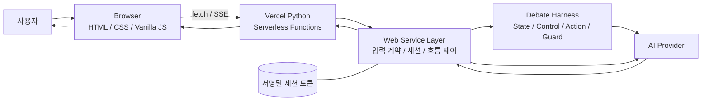
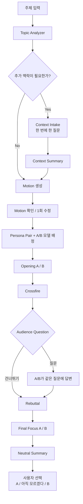
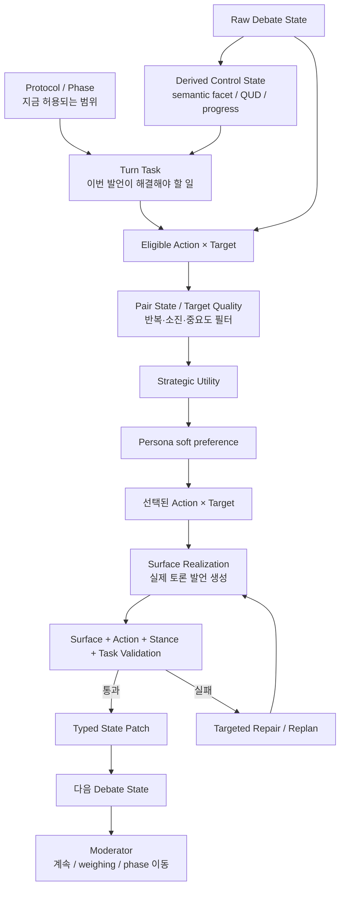
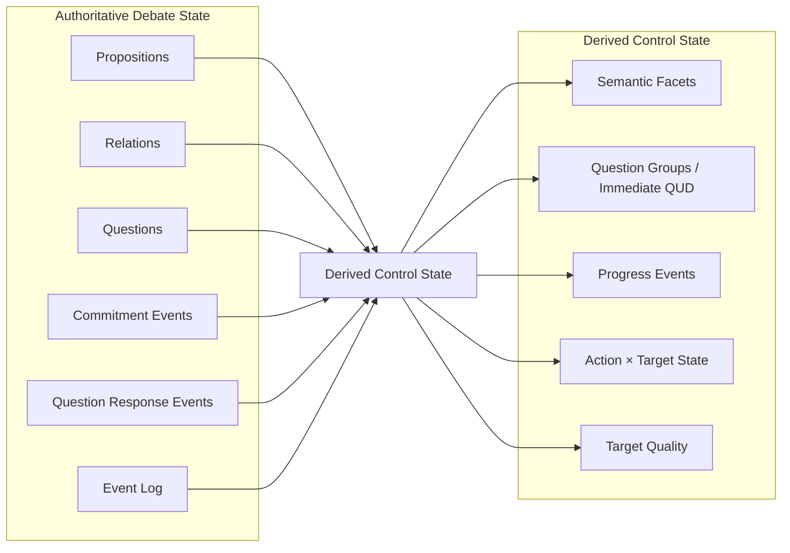
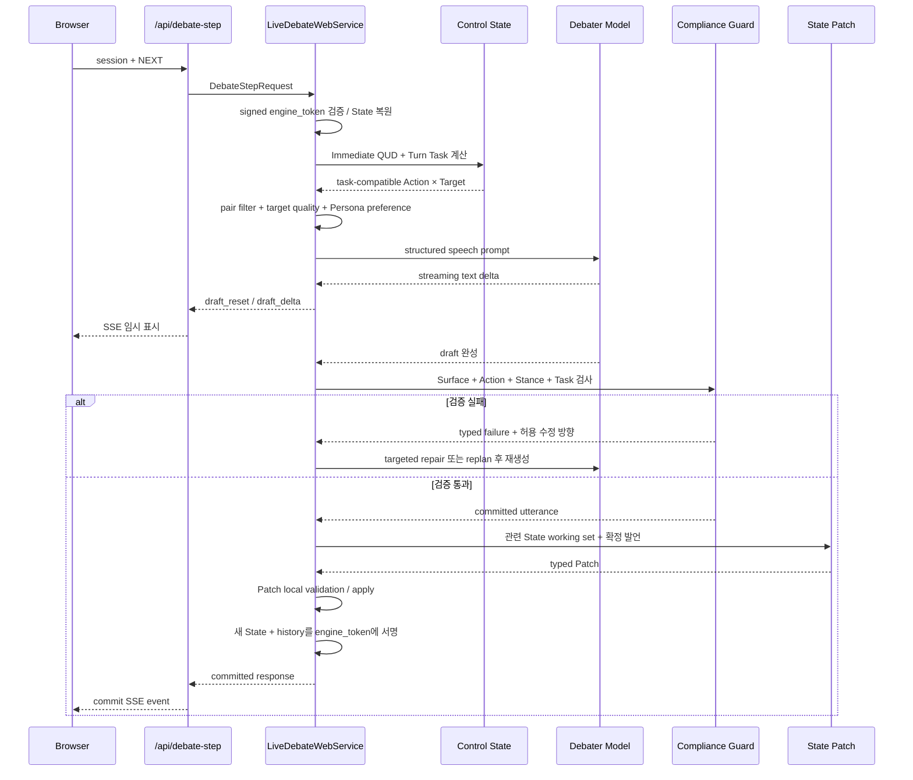
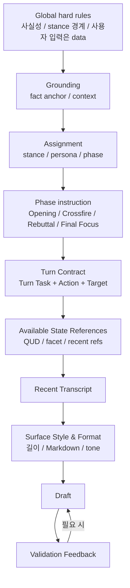
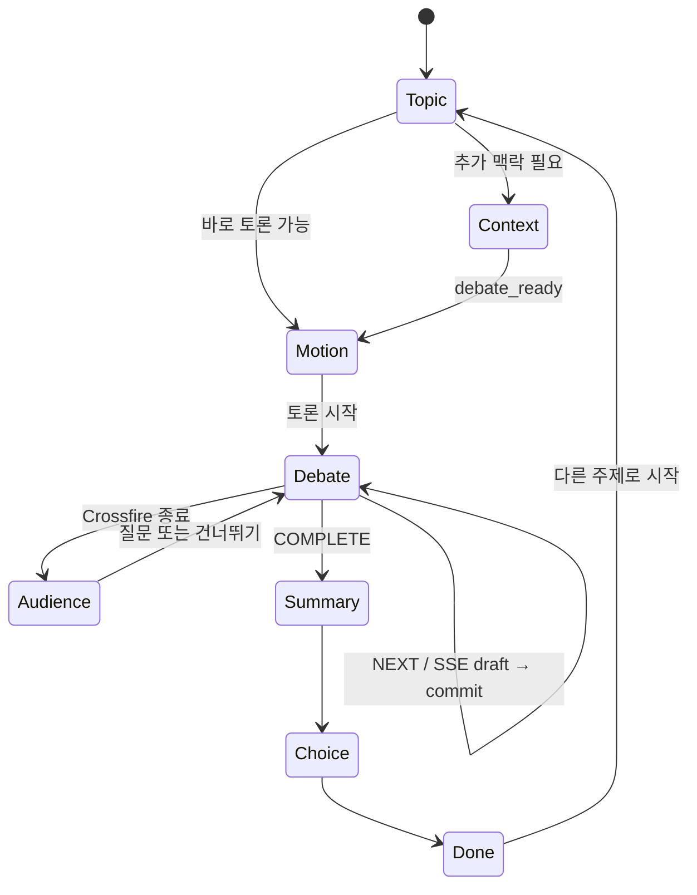
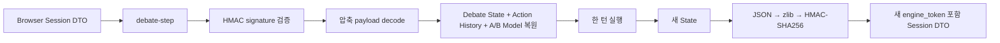

# 사이 (SAI) — AI Debate Harness

> 두 AI의 독립적인 찬반 답변을 나란히 보여주는 서비스가 아니라, **각 턴마다 상대의 실제 이전 발언과 구조화된 토론 상태를 바탕으로 다음 대응을 결정하도록 만든 AI Debate Harness**입니다.

**사이**는 사용자가 하나의 주제를 입력하면 두 AI 토론자가 순차적으로 발언하고, 서로의 주장·질문·양보·수정을 다음 턴의 판단 재료로 사용하는 관전형 AI 토론 웹 서비스입니다. 사용자는 토론을 직접 진행하기보다 공방을 관찰하고, 마지막에 어느 쪽이 더 설득력 있었는지 직접 판단합니다.

핵심 목표는 “찬성문과 반대문을 각각 생성하는 것”이 아니라 **상대가 실제로 한 말 때문에 다음 발언의 전략과 내용이 달라지는 토론**을 만드는 것입니다. 이를 위해 일반 대화 기록만 전달하지 않고, 발언에서 주장과 질문을 구조화하고, 현재 해결해야 할 쟁점을 고른 뒤, 가능한 행동을 제한하고, Persona는 그 안에서 선호만 주도록 설계했습니다.

- **서비스**: 관전형 1:1 AI 토론
- **사용자 역할**: 주제 제시 → 필요 시 맥락 제공 → 토론 관전 → 선택적 질문 → 최종 판단
- **AI 역할**: 서로 다른 입장과 행동 성향으로 실제 이전 발언에 반응
- **판정 원칙**: AI가 승자를 정하지 않으며, Neutral Summary 뒤 최종 선택은 사용자에게 남김
- **모델 구성**: multi-provider debater pool에서 토론 시작 시 A/B 토론자를 선택하고 한 토론 동안 고정

---

## 1. 전체 시스템 한눈에 보기

README의 아키텍처는 하나의 거대한 그림으로 압축하지 않고, **시스템 경계 → 애플리케이션 흐름 → 내부 Debate Engine → 상태 구조 → 단일 턴 실행 → 프롬프트/검증 → 프론트엔드 런타임** 순서로 관점을 나누어 설명합니다.



브라우저는 사용자 입력과 화면 상태만 관리합니다. API Key, authoritative Debate State, Action 선택 규칙은 브라우저에 두지 않습니다. Python Serverless Function이 Web Service와 Debate Harness를 호출하고, 서버는 토론 상태를 HMAC 서명된 세션 토큰으로 브라우저에 전달합니다. 다음 요청에서 서명을 검증해 내부 상태를 복원하므로 Serverless 환경에서도 별도 DB 없이 토론을 이어갈 수 있습니다.

AI 호출의 책임도 분리합니다. **A/B 발언 생성**은 `multi-provider debater pool`에서 토론 시작 시 선택된 두 토론자 모델이 담당하고, **주제 분석·구조화 출력·State Patch 추출·Compliance 검사·Neutral Summary**는 서버의 control/coordinator 경로가 담당합니다. A/B 배정은 한 토론 안에서는 서명된 세션에 고정됩니다.

---

## 2. 사용자 입력에서 최종 판단까지



### Topic Analyzer

처음 입력된 한 문장을 바로 찬반 프롬프트에 넣지 않습니다. `TopicAnalysis`는 현재 구현에서 다음 축을 분리해 다룹니다.

| 축 | 역할 |
|---|---|
| Claim Type | FACT, DEFINITION, CAUSE, VALUE, POLICY, COMPARISON, INTERPRETATION, PERSONAL_DISPUTE 등 주제 성격 |
| Epistemic Status | 사실 우세인지, 실제로 논쟁 가능한지, 아직 불명확한지 |
| Treatment Mode | 자연스러운 토론 / 가벼운 토론 / 재구성된 토론 |
| Interaction State | 바로 진행 / 확인 필요 / 추가 맥락 필요 / 먼저 정보 설명이 필요한 입력 |
| Truth Mode | 현실 세계 사실 / 가정된 반사실 / 수사적·놀이형 논쟁 |
| Tone | SERIOUS / PLAYFUL 표현 강도 |

이 구조의 목적은 **모든 입력을 억지로 찬반 대칭 토론으로 바꾸지 않는 것**입니다. 특히 개인 사건은 사용자가 제공하지 않은 사건 사실을 AI가 채우지 않도록 `CONTEXT_REQUIRED`로 보낼 수 있고, 단순 정보 질문은 `INFORMATIONAL_FIRST`로 구분할 수 있습니다.

### Context Intake

개인 사건처럼 사용자만 알고 있는 사실이 필요한 경우 한 번에 하나씩 질문합니다. `context_completeness`는 남은 active slot의 확보 정도를 나타내며, 핵심 대립축을 바꿀 미확인 정보가 더 없으면 `debate_ready=true`가 됩니다. Context Summary는 사용자가 제공한 내용을 **직접 본 일 / 전해 들은 이야기 / 사용자 해석 / 모르는 부분**처럼 provenance 성격별로 묶어 Motion 생성과 이후 Debate grounding에 전달합니다. 사용자가 주지 않은 사건 사실을 Context 단계에서 임의로 채우지 않는 것이 기본 규칙입니다.

### Motion

입력은 토론 가능한 명제로 정규화하고 양측 label을 함께 만듭니다. 개인 사건은 수집된 Context만 사용해 Motion을 생성합니다. 사용자는 토론을 시작하기 전에 Motion을 **1회만 수정**할 수 있습니다.

---

## 3. 코드 구조와 책임 분리

```text
public/
  index.html                 화면 구조와 3개 route
  styles.css                 반응형 레이아웃과 상태별 UI
  app.js                     화면 state, fetch/SSE, 토론 진행, 오류 UX
  debate_stream.js           Server-Sent Events parser
  debate_moderator.js        Harness 결정에 따른 사회자 카드 표현
  markdown_renderer.js       Markdown + State reference 렌더링

api/
  _base.py                   Vercel HTTP/SSE adapter
  analyze_topic.py           /api/analyze-topic
  context_step.py            /api/context-step
  create_motion.py           /api/create-motion
  debate_step.py             /api/debate-step
  neutral_summary.py         /api/neutral-summary
  health.py                  /api/health

src/web_app/
  contracts.py               Browser와 서버 사이 Pydantic DTO
  api.py                     API dispatcher와 공통 오류 응답
  live_service.py            실제 AI orchestration
  mock_service.py            Provider 호출 없는 동일 제품 흐름
  session_token.py           서명·압축된 client-carried session
  service_factory.py         Mock / Live service 선택

src/debate_engine/
  debate_contracts.py        Proposition / Relation / Question / Patch 계약
  debate_control.py          semantic facet, QUD, progress, Turn Task
  action_policy.py           Action 후보 생성과 선택
  action_pair_state.py       Action × Target 반복/소진 상태
  target_quality.py          target 중요도·행동 가능성 평가
  persona_preferences.py     Persona별 soft preference
  action_execution_contracts.py  15개 Action의 의미 계약
  combined_compliance.py     Action / Stance / Task 통합 검증과 retry
  stance_compliance.py       Assigned Stance 유지 검사
  surface_contract.py        출력 형식과 State reference 검사
  state_harness.py           State Patch 추출·검증·적용
  provider_adapter.py        구조화 출력 계약 adapter
  provider_transport.py      Provider HTTP transport

config.json                  비밀이 아닌 실행 설정
.env / Vercel Env            서버 전용 secret
```

구조를 나눈 핵심 이유는 세 가지입니다.

1. **Frontend와 AI Harness 분리**: 화면 변경이 토론 제어 로직을 건드리지 않게 합니다.
2. **Web DTO와 내부 State 분리**: 브라우저가 내부 Patch/Selector 구조를 직접 수정할 수 없게 합니다.
3. **언어 생성과 제어 분리**: LLM은 문장을 만들지만, 무엇을 할 수 있는지와 어떤 결과를 확정할지는 Harness가 관리합니다.

---

## 4. Debate Engine의 핵심 구조

이 프로젝트에서 토론은 한 모델에게 “다음으로 그럴듯한 말을 해라”라고 맡기는 구조가 아닙니다. **Protocol, State, Turn Task, Action, Persona, Guard**를 서로 다른 책임으로 분리합니다.



각 계층의 의미는 다음과 같습니다.

| 계층 | 질문 |
|---|---|
| Protocol | 지금 단계에서 무엇을 할 수 있는가? |
| Debate State | 지금까지 무엇이 주장·질문·양보·수정되었는가? |
| Control State | 같은 쟁점을 표현만 바꿔 반복하고 있지는 않은가? 지금 해결 중인 질문은 무엇인가? |
| Turn Task | 이번 발언이 가장 먼저 해야 할 일은 무엇인가? |
| Action × Target | 어떤 논점에 어떤 방식으로 대응할 것인가? |
| Persona | 적법한 행동들 중 어떤 행동을 더 선호하는가? |
| Surface Realizer | 선택한 행동을 어떤 문장으로 표현할 것인가? |
| Guard | 발언이 실제로 선택한 행동·입장·과제를 수행했는가? |
| State Patch | 확정된 발언에서 무엇을 State에 추가할 것인가? |
| Moderator | 더 말할 가치가 있는가, 다음 단계로 넘어갈 것인가? |

---

## 5. Debate State: 대화 기록이 아니라 다음 행동을 위한 상태

Raw Debate State는 전체 자연어 대화를 다시 저장하는 대체물이 아니라, **다음 턴의 판단에 필요한 최소 구조화 상태**입니다.



### Proposition

주장·근거·예시를 영구적으로 서로 다른 Node Type으로 나누지 않고 `Proposition`을 기본 단위로 사용합니다. 어떤 Proposition이 근거인지 결론인지는 Relation으로 표현합니다.

### Relation

현재 authoritative relation은 다음 네 가지입니다.

- `SUPPORTS`: 다른 Proposition의 이유·근거·정당화를 제공
- `ATTACKS`: 다른 Proposition의 근거나 타당성을 약화
- `CONTRADICTS`: 같은 조건에서 동시에 참일 수 없는 충돌
- `QUALIFIES`: 적용 범위·조건·정도를 제한

### Question

질문은 별도 Entity입니다. 질문 자체의 `OPEN / RESOLVED`와 응답 품질 `DIRECT / QUALIFIED / PARTIAL / EVADED / FRAME_REJECTED_VALID / UNCLEAR`을 분리합니다. 그래서 “답변이 있었지만 핵심은 아직 해결되지 않은 질문”과 “정당하게 질문의 프레임을 거부한 경우”를 같은 상태로 취급하지 않습니다.

### Commitment Event

토론자가 공개적으로 책임지는 변화는 append-only event로 남깁니다.

- `ASSERT`
- `CONCEDE`
- `WITHDRAW`
- `REVISE`

수정이 일어나도 기존 Proposition text를 덮어쓰지 않습니다. 새 Proposition과 `REVISE` event를 추가해 이전 입장과 이후 입장을 모두 보존합니다.

> 아래 README에서는 아키텍처 이해에 직접 필요한 State와 제어 필드만 설명합니다. 실제 코드에는 provenance, source turn, working-set metadata, debug bookkeeping 등 추가 필드가 있으며, **문서 길이와 가독성을 위해 순수 구현 세부 필드는 생략했습니다.**

---

## 6. 같은 말을 새 ID로 반복하지 않게 하는 Control State

Raw State에 새 Proposition ID가 생겼다는 사실만으로 “토론이 진전됐다”고 판단하면, 모델은 같은 논점을 표현만 바꿔 계속 새 주장처럼 저장할 수 있습니다. 그래서 Raw State 위에 **의미 단위의 Derived Control State**를 둡니다.

새 Proposition은 다음과 같이 의미 관계를 함께 판정합니다.

- `NEW_REASON`
- `SAME_POINT`
- `REFINEMENT`
- `NEW_COUNTEREXAMPLE`
- `QUALIFICATION`
- `RELATED_DISTINCT`

`SAME_POINT`, `REFINEMENT`, `QUALIFICATION`은 기존 semantic anchor와 같은 **semantic facet**으로 묶일 수 있습니다. 따라서 새 C ID가 생성되어도 같은 facet이면 `Action × Target` 반복 제한을 우회할 수 없습니다.

### Immediate QUD

질문 목록을 단순 FIFO로 소비하지 않고, **현재 가장 먼저 해결해야 하는 질문 초점**을 관리합니다. 같은 턴에서 같은 논점을 향해 여러 의문문이 나와도 하나의 답으로 함께 해결될 수 있다면 하나의 Question Group으로 취급합니다. 최신 QUD가 해결된 뒤 예전의 unrelated OPEN 질문을 자동으로 다시 꺼내지 않습니다.

이 구조는 담화를 “현재 해결 중인 질문”을 중심으로 보는 QUD 접근과, 한 question turn 안의 연속된 질문 성분을 묶는 MIU 연구를 참고해 구현했습니다. 또한 argumentation dialogue에서 각 move가 이전 move와 명시적인 reply 관계를 갖도록 하는 접근도 현재 Control State의 방향과 맞닿아 있습니다 (Roberts, 2012; Prakken, 2005; D’Agostino et al., 2024).

### Turn Task

Action을 고르기 전에 “이번 발언의 대화적 의무”를 먼저 정합니다.

| Turn Task | 의미 |
|---|---|
| `INTRODUCE_UNCOVERED_FACET` | 아직 다뤄지지 않은 핵심 측면 제시 |
| `ANSWER_OPEN_QUESTION` | 현재 열린 핵심 질문에 직접 답변 |
| `ADDRESS_AUDIENCE` | 관객 질문에 직접 답변 |
| `ADDRESS_COUNTEREXAMPLE` | 최근 반례를 처리 |
| `TEST_UNRESOLVED_REASON` | 아직 해결되지 않은 이유를 검증 |
| `WEIGH_COMPETING_REASONS` | 경쟁하는 이유를 같은 기준에서 비교 |
| `NARROW_DISAGREEMENT` | 동의/불일치 범위를 좁힘 |
| `CRYSTALLIZE` | 이미 나온 핵심 충돌을 압축 |
| `NO_VALUABLE_MOVE` | 현재 단계에서 추가 발언 가치가 낮음 |

`ANSWER_OPEN_QUESTION`에서는 Persona가 좋아하는 Action을 먼저 고르는 것이 아니라, **질문이 실제로 가리키는 Proposition에 대응 가능한 Action만 남긴 뒤 Persona가 그 안에서 선택에 영향을 줍니다.**

질문에 답하는 행위 자체를 별도의 만능 Strategic Action으로 두지는 않습니다. 열린 질문이나 Audience Question이 있으면 **직접 답해야 한다는 Response Obligation을 Turn Task가 먼저 고정**하고, 그 의무를 만족하는 범위 안에서 방어·수정·반박·양보 같은 Strategic Action을 선택합니다. 그래서 전략적 동작이 완벽하지 않더라도 질문에 실질적으로 답했고 stance를 지켰다면 불필요한 retry를 강제하지 않습니다.

---

## 7. Strategic Action Set

현재 Runtime은 15개의 Action을 사용합니다. Action은 단순 프롬프트 라벨이 아니라 각자 **target type, 반드시 나타나야 할 의미 효과, 허용 표현, 실패 패턴**을 가진 실행 계약입니다.

| Action | 역할 |
|---|---|
| `CLARIFY_CLAIM` | 주장 의미·범위·용어를 명확히 하도록 요구 |
| `REQUEST_SUPPORT` | 주장에 대한 근거·이유·정당화를 요구 |
| `CHALLENGE_PREMISE` | 전제의 사실성·필요성·적용 가능성을 문제 삼음 |
| `CHALLENGE_INFERENCE` | 근거에서 결론으로 가는 추론의 충분성을 문제 삼음 |
| `TEST_BOUNDARY` | 반례·경계 사례로 주장 적용 범위를 시험 |
| `CHECK_CONSISTENCY` | 기존 commitment와 현재 주장 사이의 긴장을 확인 |
| `SEEK_COMMITMENT` | 상대가 특정 기준·명제에 명시적으로 입장을 정하도록 요구 |
| `PRESS_UNANSWERED` | 부분 답변/회피 상태의 핵심 질문을 좁혀 다시 요구 |
| `CONCEDE_LOCAL` | 상대의 특정 논점을 인정하되 전체 입장은 유지 |
| `REVISE_CLAIM` | 자신의 기존 주장을 실제로 수정·한정 |
| `REFUTE_CLAIM` | 상대 주장을 이유와 함께 직접 반박 |
| `DEFEND_CLAIM` | 공격받은 자신의 주장을 근거·구분·한정으로 방어 |
| `EXTEND_ARGUMENT` | 현재 입장을 지지하는 새로운 관련 이유를 추가 |
| `WEIGH_COMPARATIVE` | 경쟁하는 두 고려사항을 같은 비교 기준에서 평가 |
| `CRYSTALLIZE` | 새 핵심 근거 없이 이미 나온 핵심 clash를 압축 |

선택 순서는 개념적으로 다음과 같습니다.

```text
Hard Eligibility
→ Action × Target Pair Filter
→ Target Quality
→ Strategic Utility
→ Persona Preference
→ Repetition / Saturation
```

Action×Target pair 자체도 `AVAILABLE / OPEN / PARTIALLY_RESOLVED / RESOLVED / EXHAUSTED / BLOCKED` 상태로 관리합니다. 같은 의미 facet에 대해 이미 소진한 행동을 새 Proposition ID로 우회하지 못하게 하고, 국소적 양보가 확정된 facet은 다시 같은 방식으로 공격하는 후보에서 제외할 수 있습니다.

Target은 단순 최신순이 아니라 핵심 주장인지, 아직 해결되지 않았는지, 현재 clash와 관련 있는지, 질문 의존성이 있는지, 수사적 표현에 불과한지, 최근에 얼마나 사용됐는지 등을 coarse metadata로 평가합니다. 그 뒤 strategic utility와 Persona preference를 적용합니다.

Persona는 **후보를 새로 만들 수 없고**, 이미 `BLOCKED / RESOLVED / EXHAUSTED` 된 Action×Target pair를 되살릴 수도 없습니다.

---

## 8. Persona: 캐릭터가 아니라 행동 선호 정책

Persona는 토론자의 고정된 세계관이나 “말투 캐릭터”가 아닙니다. 현재 구현에서는 **적법한 Action 후보들 사이의 안정적인 soft preference**로 사용합니다. Stance는 별도의 session assignment이므로 같은 Persona가 다른 토론에서는 반대 입장을 맡을 수 있습니다.

Persona 연구에서는 role-playing persona, personality prompting, role과 expressive style이 실제 출력에 미치는 영향을 분리해서 볼 필요가 있음을 참고했습니다. 그 결과 MVP에서는 Big Five나 MBTI를 runtime 제어 변수로 사용하지 않고, **토론 행동과 직접 연결되는 고정 Persona → Action preference**만 남겼습니다. 특히 personality, role, style이 상호작용한다는 결과를 고려해 Persona와 Assigned Stance를 분리했습니다 (Tseng et al., 2024; Jiang et al., 2024; Nagao et al., 2026).

| Persona | 화면 표시 | 주된 행동 선호 |
|---|---|---|
| Auditor | 근거 검증형 | 근거 요구, 추론 연결 검증, 일관성 확인 |
| Socratic | 전제 탐구형 | 정의·범위 확인, 숨은 전제 탐색, 명시적 입장 요구 |
| Falsifier | 반례 탐색형 | 반례·경계 테스트, 일관성 검사, 직접 반박 |
| Pragmatist | 현실 실용형 | 결과·비용·trade-off 비교, 반박과 방어 |
| Principlist | 원칙 중심형 | 기준·전제·일관성 점검, 원칙 기반 이유 확장 |
| Synthesist | 조정 통합형 | 국소적 양보, 주장 수정, 비교·핵심 압축 |

Topic Analyzer의 claim type에 따라 기능적으로 다른 Persona pair를 선택합니다. 예를 들어 정의형 주제에는 정의·전제를 파고드는 성향과 반례를 찾는 성향을 조합하고, 정책·가치형 주제에는 원칙과 실제 결과를 다르게 보는 성향을 조합합니다.

---

## 9. 한 턴이 만들어지고 확정되는 과정



브라우저에 보이는 streaming 문장은 **확정 전 draft**입니다. 모델이 문장을 생성하기 시작하면 `draft_reset`과 `draft_delta` 이벤트로 화면에 표시하지만, Guard와 State Patch가 모두 통과하기 전에는 transcript에 확정하지 않습니다.

### 검증 실패와 Repair

발언 검증은 하나의 “맞다/틀리다” 판정이 아니라 실패 종류를 구분합니다.

- Assigned Stance를 뒤집었는가
- 선택한 Action을 실제로 수행했는가
- Action target을 사용했는가
- 이번 Turn Task를 해결했는가
- 같은 말만 바꿔 반복했는가
- 허용되지 않은 State ID를 출력했는가
- Final Focus 형식을 위반했는가

첫 실패에서는 이전 draft와 failure location, 잘못된 부분, 유지해야 할 부분, 허용되는 수정 방향을 함께 전달해 **targeted repair**를 시도합니다. 같은 계획으로 고치기 어려운 구조적 실패가 반복되면 세 번째 시도 전 Action/Target을 다시 고를 수 있습니다. 최대 시도 안에 안전하게 확정되지 않으면 해당 턴을 commit하지 않고 State도 변경하지 않습니다.

이 retry 구조는 단순히 “다시 써라”라고 재호출하기보다 validator가 실패 위치와 admissible alternatives를 제공할 때 repair 성공률이 높아졌다는 structured-feedback 연구를 참고했습니다 (Ray & Goyal, 2026).

---

## 10. State Patch와 Adaptive Context

발언이 확정된 뒤에도 LLM에게 전체 Debate State를 다시 작성하게 하지 않습니다. 확정 발언에서 **typed Patch operation**만 추출하고 Pydantic과 local reference rule을 통과한 Patch만 적용합니다.

주요 Patch operation은 다음과 같습니다.

```text
ADD_PROPOSITION
ADD_RELATION
ASK_QUESTION
ANSWER_QUESTION
REVISE_PROPOSITION
CONCEDE_LOCAL
WITHDRAW_PROPOSITION
```

새 Proposition은 Patch 내부 임시 ID를 먼저 사용하고 실제 State 적용 시 C ID로 변환합니다. Relation은 기존 C ID나 같은 Patch의 임시 Proposition만 참조할 수 있습니다. Question은 Q ID, Proposition은 C ID처럼 entity type을 구분해 잘못된 참조가 State에 들어가는 것을 막습니다.

Patch 적용 전에는 명시적인 질문 표현이 있는데 `ASK_QUESTION`이 누락되지 않았는지도 별도 local guard로 확인합니다. Relation은 같은 `from / to / type` 조합을 중복 저장하지 않고, 기존 Proposition text는 수정하지 않으며 revision은 새 Proposition과 event로 표현합니다.

### 관련 State만 전달

토론이 길어질수록 전체 State graph를 매번 프롬프트에 넣으면 비용뿐 아니라 관련 정보의 사용성도 나빠질 수 있습니다. 그래서 State Patch와 발언 생성에는 **현재 Action target, Immediate QUD, semantic facet의 대표/현재 node, 명시적으로 참조된 State, 양측 최근 Proposition**을 중심으로 working set을 만듭니다. Patch용 Proposition working set은 현재 구현에서 최대 10개로 제한합니다.

긴 context에서 필요한 정보의 위치와 양에 따라 모델 활용 성능이 달라질 수 있다는 연구를 참고해, 이 프로젝트는 fixed full-history보다 현재 State graph에서 관련 node를 선택하는 방식을 사용합니다 (Liu et al., 2024).

---

## 11. State Reference와 사용자 화면 연결

토론자는 기존 State의 특정 주장이나 질문을 가리킬 때 임의의 자연어 인용을 새로 만들지 않고 `[[C24]]`, `[[Q3]]` 형식의 marker를 사용할 수 있습니다. 단, 이번 턴의 working set에 포함된 reference만 허용합니다.

서버는 확정 후 marker를 `StateReference` metadata로 변환하고, Frontend는 이를 내부 ID 그대로 보여주는 대신 **A/B · 발언 번호** 형태의 링크 chip으로 렌더링합니다. 사용자가 chip을 누르면 실제 원 발언으로 이동합니다.

```mermaid
flowchart LR
    S[State C/Q Entity] --> P[Speech Prompt<br/>available references]
    P --> M[LLM marker<br/>[[C24]] / [[Q3]]]
    M --> V[Local reference validation]
    V --> R[StateReference metadata]
    R --> UI[사용자용 발언 링크 chip]
```

이렇게 내부 구조화 State와 사람이 읽는 transcript를 직접 연결하면서도, 존재하지 않는 ID를 모델이 추측해서 인용하는 것은 차단합니다.

---

## 12. Prompt Architecture

프롬프트는 거대한 한 덩어리의 역할 지시문으로 만들지 않고, **변하지 않는 규칙 / 현재 세션 정보 / 이번 턴의 과제 / 허용된 State context / 출력 계약**을 분리합니다.



현재 speech prompt는 XML 구획을 사용해 `identity`, `hard_rules`, `grounding`, `assignment`, `phase_instruction`, `surface_style`, `surface_format`을 나눕니다. Motion, Context, transcript, Audience Question은 instruction과 섞이지 않도록 data 영역으로 넣습니다.

전역 품질 규칙은 Persona보다 항상 우선합니다. 사용자가 제공하지 않은 개인 사건의 사실·존재하지 않는 통계나 연구를 만들지 않고, 상대가 실제로 하지 않은 주장을 공격하지 않으며, 질문에는 직접 답하고 유효한 반론은 인정할 수 있어야 합니다. 국소적 양보와 세부 주장 수정은 허용하지만 Assigned Stance 전체를 상대편으로 뒤집는 것은 별도 guard가 막습니다.

특히 Persona는 전체 프롬프트를 지배하는 캐릭터 설정이 아니라 **Assigned Stance와 Global Quality Contract 아래에서 동작**합니다. Final Focus는 새로운 핵심 근거를 만들지 않고 두 문장 이내의 한 문단으로 끝내는 등 phase별 surface contract도 별도로 둡니다.

---

## 13. Moderator와 Debate Protocol

Moderator는 세 번째 LLM 토론자도, 승자를 정하는 Judge도 아닙니다. **Harness State를 사람이 읽기 좋은 진행 신호로 바꾸고, 더 가치 있는 다음 행동이 있는지 판단하는 tempo/controller 역할**입니다.

기본 schedule은 다음 단계의 **최대 cap**입니다.

```text
Opening A / B
→ Crossfire 최대 6 turns
→ Optional Audience Question (양측 답변)
→ Rebuttal A / B
→ Final Focus A / B
→ Neutral Summary
→ User Choice
```

Crossfire와 Rebuttal에서는 고정 turn 수를 반드시 채우지 않습니다. Control Plane이 `NO_VALUABLE_MOVE`를 반환하면 Provider 호출 전에 다음 단계로 이동할 수 있습니다. 따라서 schedule은 quota가 아니라 상한입니다.

이 프로젝트에서 **Crossfire는 정해진 질문을 번갈아 읽는 Q&A 단계가 아니라, 현재 Debate State를 실제로 바꾸는 제한된 전략 구간**입니다. 상대의 직전 발언에서 검증할 지점을 찾고, 반례·추론 공격·commitment 요구·국소적 양보·수정 같은 행동으로 다음 상태를 만들어냅니다. 관전 재미도 별도의 농담 생성 모듈을 붙이기보다, 상대가 방금 한 말에 대한 callback·새 반박·반례·양보처럼 **상호작용 자체에서 생기도록** 설계했습니다. PLAYFUL 주제에서는 가벼운 비유나 논증에서 나온 유머를 허용하지만 상대 인격에 대한 공격은 허용하지 않습니다.

Audience Question은 일반 debate agenda보다 우선하는 임시 QUD로 취급하고 A와 B 모두 같은 질문에 답하게 합니다. Final Focus에서는 새 substantive argument를 만들지 않고 지금까지의 핵심 이유를 압축합니다.

Neutral Summary는 다음만 정리합니다.

- 핵심 충돌
- A의 강한 논점
- B의 강한 논점
- 함께 인정한 부분
- 남은 질문

승자·점수·정답 판정은 하지 않습니다.

---

## 14. Frontend Runtime Architecture

Frontend는 단순히 `fetch()` 결과를 HTML에 넣는 역할만 하지 않습니다. 긴 AI 호출과 순차 토론을 안정적으로 보여주기 위해 자체 UI state와 streaming lifecycle을 관리합니다.



### 주요 Frontend 책임

- `route`, `view`, `session`, `summary`, `choice` 등 화면 상태 관리
- 요청 중복 방지와 operation sequence 기반 stale response 차단
- `AbortController`를 이용한 지연/중단 처리
- Debate SSE의 `draft_reset → draft_delta → commit/error` 처리
- provisional draft와 committed transcript 분리
- Markdown sanitize/render
- State reference chip 클릭 시 원 발언 이동
- Harness의 phase 전환을 deterministic moderator card로 시각화
- 모바일/데스크톱 반응형 UI
- Raw stack trace나 Provider payload 대신 안정적인 사용자 오류 메시지 표시

### Loading / Success / Failure

API layer는 성공 시 공통적으로 `{ ok: true, data }`, 실패 시 `{ ok: false, error: { code, message } }` 형태를 사용합니다. 주요 오류는 `INVALID_INPUT`, `SAFE_FAILURE`, `CONFIG_ERROR`, `TIMEOUT`, `API_ERROR` 등으로 구분됩니다.

Frontend는 요청이 길어지면 상태 메시지를 갱신하고, 일정 시간이 지나면 사용자가 기다리기를 중단할 수 있게 하며, 최종 timeout 경로에서는 진행 중 요청을 abort합니다. 토론 중 실패해도 이미 commit된 이전 transcript는 유지됩니다.

---

## 15. Serverless Session Architecture

Vercel Serverless Function은 요청 사이의 메모리를 신뢰할 수 없기 때문에, 토론 엔진의 authoritative state를 서버 프로세스 전역 변수에 보관하지 않습니다.



`engine_token`에는 browser-visible session, internal Debate State, Action history, A/B model assignment가 포함되고 `SESSION_SECRET`으로 서명됩니다. 브라우저가 `next_index` 같은 공개 필드를 임의로 바꾸더라도 이미 서명된 토론에서는 token에서 복원한 내부 상태가 우선합니다.

---

## 16. API와 데이터 계약

| Endpoint | 주요 입력 | 역할 | 주요 출력 |
|---|---|---|---|
| `POST /api/analyze-topic` | 사용자 topic | 주제 분류, epistemic/treatment/interaction 상태 결정 | `TopicAnalysis` |
| `POST /api/context-step` | topic + 이전 답변 | 필요한 개인 맥락을 한 질문씩 수집 | 다음 질문 또는 `context_summary` |
| `POST /api/create-motion` | analysis + context + optional edit | 토론 Motion, side label, Persona pair 결정 | `MotionResponse` |
| `POST /api/debate-step` | signed session + command | 다음 턴 planning/generation/validation/state update | SSE draft + committed `DebateStepResponse` |
| `POST /api/neutral-summary` | motion + committed transcript | 승자 판정 없는 토론 정리 | clash / 강점 / 합의 / 미해결 쟁점 |
| `/api/health` | 없음 | Serverless와 live config 상태 확인, Provider 호출 없음 | ready / mode / version |

Browser-facing DTO는 Pydantic `extra="forbid"` 계약을 사용합니다. 내부 Patch, Action 후보, Control State는 Web DTO에 그대로 노출하지 않습니다.

> API 표 역시 전체 Pydantic field 목록을 복제한 것이 아니라 **시스템 흐름을 이해하는 데 필요한 데이터만 요약**했습니다. 길이와 가독성을 위해 validation용 세부 필드와 bookkeeping 값은 생략했습니다.

---

## 17. 기술 스택

| 영역 | 사용 기술 |
|---|---|
| Frontend | HTML, CSS, Vanilla JavaScript |
| Backend | Python 3.12, Vercel Serverless Functions |
| Schema / Validation | Pydantic |
| Streaming | Server-Sent Events (SSE) |
| AI Integration | OpenAI-compatible Chat Completions / Tool Calling |
| Debater Routing | multi-provider debater pool |
| Session | zlib-compressed + HMAC-SHA256 signed client-carried state |
| Deployment | GitHub + Vercel |

---

## 18. 실행·배포 정보

과제 제출 요구를 위해 실행/배포 정보는 최소한으로 남깁니다.

- **배포 URL**: https://a1-3-green.vercel.app
- **GitHub**: https://github.com/hodob/A1-3
- **비밀 환경 변수**: `DEBATER_API_KEY`, `SESSION_SECRET`
- **일반 실행 설정**: `config.json`

로컬 UI 확인은 Provider 호출이 없는 Mock service로 실행할 수 있습니다.

```bash
python -m etc.tools.web_dev_server
```

Vercel은 `public/`을 정적 Frontend로 제공하고 `api/*.py`를 Python Serverless Function으로 실행합니다. Browser는 항상 상대 경로 `fetch('/api/...')`로 Backend를 호출하며 API Key는 Frontend에 전달하지 않습니다.

---

## References

아래 자료들은 README에서 직접 언급한 설계 판단에 사용한 자료입니다. 프로젝트의 모든 세부 선택을 논문으로 정당화하려는 것이 아니라, **실제로 구조에 영향을 준 개념에만 출처를 연결**했습니다.

- Tseng, Yu-Min et al. (2024). *Two Tales of Persona in LLMs: A Survey of Role-Playing and Personalization*. Findings of EMNLP 2024. https://aclanthology.org/2024.findings-emnlp.969/
- Jiang, Hang et al. (2024). *PersonaLLM: Investigating the Ability of Large Language Models to Express Personality Traits*. Findings of NAACL 2024. https://aclanthology.org/2024.findings-naacl.229/
- Nagao, Moe et al. (2026). *Personality, Role, and Expressive Style in Large Language Models: An Interactionist Analysis*. arXiv preprint. https://arxiv.org/abs/2605.28037
- Roberts, Craige (2012). *Information Structure in Discourse: Towards an Integrated Formal Theory of Pragmatics*. Semantics & Pragmatics, 5. https://doi.org/10.3765/sp.5.6
- Prakken, Henry (2005). *Coherence and Flexibility in Dialogue Games for Argumentation*. Journal of Logic and Computation. https://doi.org/10.1093/logcom/exi046
- D’Agostino, Giulia, Chris Reed, and Daniele Puccinelli (2024). *Segmentation of Complex Question Turns for Argument Mining: A Corpus-based Study in the Financial Domain*. LREC-COLING 2024. https://aclanthology.org/2024.lrec-main.1265/
- Liu, Nelson F. et al. (2024). *Lost in the Middle: How Language Models Use Long Contexts*. Transactions of the Association for Computational Linguistics, 12, 157–173. https://aclanthology.org/2024.tacl-1.9/
- Ray, Jaideep & Ankit Goyal (2026). *Structured Feedback Improves Repair in an LLM Agent Loop*. arXiv preprint. https://arxiv.org/abs/2607.14167
